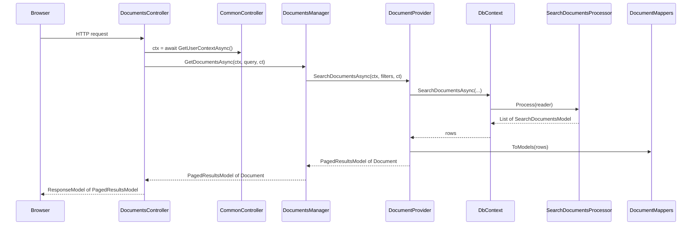

# C# coding guidelines

The Bliss Framework's [general coding guidelines](../coding-guidelines/index.md) describe application services in the abstract. C# on ASP.NET Core is the language they were originally written against, so the fit is direct: the [three-layer model](../coding-guidelines/layers-of-application.md) maps onto **Controllers → Managers → Providers** almost word for word. What this page adds is the concrete dialect we use at KeenMate — the `UserContext` object passed as the first argument to every business call, an autogenerated database provider layer (`db-gen`), the `ResponseModel<T>` envelope at the I/O boundary, and the conventions that keep a large ASP.NET solution navigable.

Read the [general coding guidelines](../coding-guidelines/index.md) and [general naming conventions](../coding-guidelines/general-naming-conventions.md) first — everything here builds on them. We assume Microsoft's [C# coding conventions](https://learn.microsoft.com/en-us/dotnet/csharp/fundamentals/coding-style/coding-conventions) and [framework naming guidelines](https://learn.microsoft.com/en-us/dotnet/standard/design-guidelines/naming-guidelines) as the baseline; this page only covers where Bliss adds or constrains a rule. This section is illustrated throughout with the KeenMate DocumentHub backend (`.NET 6`, ASP.NET Core, PostgreSQL, Serilog, Quartz) — the reference implementation these conventions were distilled from.

## What's different from a typical Bliss service

| Topic | Generic Bliss service | C# / ASP.NET Core |
|-------|-----------------------|-------------------|
| Runtime | One process, threads inside | One process, `async`/`await` over the thread pool; work is `Task`-based |
| Layering | I/O → Management → Providers | `*Controller` → `*Manager` → `*Provider`, plus `*Service` in the Side layer |
| Solution shape | Folders / projects | Three projects: `*.Web` (I/O + Management + Providers), `*.Database` (generated), `*.Common` (shared) |
| Identifiers | Varies | `PascalCase` for types/methods/properties, `camelCase` for locals/parameters/**fields** (no `_` prefix — see [naming](./naming-conventions.md#private-fields-plain-camelcase)) |
| Errors | Varies | Exceptions, caught once in `CatchMiddleware`; the I/O boundary emits a `ResponseModel<T>` / `ErrorResponseModel<T>` envelope |
| Validation | Often inside services | At the I/O layer (controller / model binding) and at the boundary of each manager call |
| User identity | DI-injected `ICurrentUser` | `UserContext` object built once by the controller and passed as the **first argument** to every manager and provider call |
| "Side layer" | Models, Helpers, Mappers, Constants | `Models.*`, `Mappers` (static), `Helpers` (static), `Services` (stateful/DI'd), `Options`, `Constants`, `Enums` |
| Database | Varies | One `*Provider` per subject wrapping an autogenerated `DbContext`; one C# method per stored function |
| Background work | Hosted services / queues | Quartz `IJob` classes acting under a system `UserContext` |
| Config | Varies | `appsettings.json` + environment overrides, bound to strongly-typed `*Options` via the [Options pattern](#configuration) |

## What stays the same

These Bliss principles apply unchanged:

1. **[Be replaceable](../consistency-is-bliss.md#be-replaceable)** — your managers, your providers, your method signatures. A future maintainer should be able to read a manager cold and know what it orchestrates. Don't lean on cleverness only the original author understands.
2. **[Ubiquitous Language](../learning-guidelines/basic-principles.md#domain-driven-development)** — `document`, `tenant`, `scope`, `category` mean the same thing in `public.get_document` (DB), `DocumentProvider.GetDocumentAsync`, `DocumentsManager`, the `/api/documents` endpoint, and `Documents.svelte`. The general rule — a database table is singular, a collection-shaped method/endpoint is plural — holds here: `DocumentsController`, `DocumentsManager.GetDocumentsAsync`, `DocumentProvider.GetDocumentAsync`.
3. **[DRY](../learning-guidelines/basic-principles.md#dont-repeat-yourself)** — pagination lives in one `PagedResultsModel<T>`, the response envelope in one `ResponseModel<T>`, ensure-a-directory in one `DirectoryHelper`, the SMTP settings in one `SmtpOptions`. Not re-implemented per feature.
4. **[Use only what you need](../learning-guidelines/basic-principles.md#use-only-what-you-need)** — no interface for a class with one implementation and no test double, no `Service` where a `static` helper does, no manager where the controller could call one provider. Add the abstraction when the second caller (or the mock) appears.
5. **[Restrain yourself](../key-elements.md#restrain-yourself)** — one response envelope, one `UserContext` shape, one logging convention, one way of reading configuration. Pick once, apply everywhere.
6. **Side layer purity** — `Models`, `Mappers`, and `Helpers` carry no dependency on controllers, on the DI container, or on `HttpContext`. They could be lifted into a class library tomorrow. `KeenMate.DocumentHub.Common` is exactly that library.

## The three-project split

Every ASP.NET service we ship is one solution with (at least) three projects:

```
KeenMate.DocumentHub.sln
├── KeenMate.DocumentHub.Web/            # The application — I/O, Management, Providers, Side
│   ├── Controllers/                 # I/O layer — thin HTTP entry points
│   ├── Managers/                    # Management layer — orchestration
│   ├── Providers/                   # Providers layer — atomic data/external access
│   │   ├── ADProviders/             #   one folder per external-system family
│   │   ├── EmailProviders/
│   │   └── SmsProviders/
│   ├── Services/                    # Side layer — stateful/DI'd utilities
│   ├── Models/                      # Side layer — data containers, per-feature folders
│   │   ├── Documents/
│   │   ├── Users/
│   │   └── Tenants/
│   ├── Mappers/                     # Side layer — static transformations
│   ├── Helpers/                     # Side layer — static, stateless tools
│   ├── Options/                     # Side layer — strongly-typed config classes
│   ├── Constants/  Enums/           # Side layer — centralized literals
│   ├── Interfaces/                  # Contracts for DI'd managers/providers/services
│   ├── Extensions/                  # Extension methods (incl. ServiceCollectionExtensions)
│   ├── Middlewares/                 # Cross-cutting request pipeline
│   ├── Jobs/                        # Quartz background jobs
│   └── Program.cs                   # Composition root
│
├── KeenMate.DocumentHub.Database/       # Generated provider infrastructure
│   └── Generated/
│       ├── DbContext.cs             #   one method per stored function
│       ├── Models/                  #   one model per stored-function result row
│       └── Processors/              #   one reader→model parser per stored function
│
└── KeenMate.DocumentHub.Common/         # Cross-cutting, framework-free utilities
    └── Extensions/                  #   StringExtensions, EnumerableExtensions, ...
```

The `*.Web` project holds the trio *and* the Side layer — ASP.NET keeps them together, and that is fine. What matters is the direction of dependencies, not the project boundary: Controllers may call Managers; Managers may call Providers and Services; Providers call the outside world and nothing else in the app. Never the reverse.

## Layer-first or feature-first

The tree above is **layer-first**: top-level folders group files by *kind* (`Controllers/`, `Managers/`, `Providers/`, `Models/`). There is a second, equally valid shape — **feature-first** — where top-level `Features/<Subject>/` folders group files by *subject*, and each subject folder holds its own controller, manager, provider(s), and models:

```
KeenMate.DocumentHub.Web/
├── Features/
│   ├── Documents/
│   │   ├── DocumentsController.cs
│   │   ├── DocumentsManager.cs      (+ IDocumentsManager.cs)
│   │   ├── DocumentProvider.cs      (+ IDocumentProvider.cs)
│   │   └── Models/                  # models get their own subfolder — there are too many
│   │       ├── DocumentModel.cs
│   │       ├── DocumentDetailModel.cs
│   │       └── GetDocumentsQuery.cs
│   ├── Tenants/
│   │   ├── TenantsController.cs
│   │   ├── TenantManager.cs
│   │   ├── TenantProvider.cs
│   │   └── Models/
│   └── Users/
│       └── ...                      # same shape, every feature
│
├── Services/     Helpers/     Extensions/     Options/     Constants/     Middlewares/
│                                    # cross-cutting Side layer stays top-level
└── Program.cs
```

Same idea in either shape: the layer **roles** and the dependency direction are identical — a `Feature/Documents/` folder still contains a thin controller, an orchestrating manager, and an atomic provider, and dependencies still flow I/O → Management → Providers. Only the *physical grouping* changes. Namespaces still mirror the folder path, so feature-first files land in `Company.Product.Web.Features.Documents` (see [naming — projects and namespaces](./naming-conventions.md#projects-and-namespaces)). `Models/` almost always becomes a subfolder inside the feature because a single subject spawns many request/detail/query models; the handful of files at the feature root are the controller, the manager, and the provider(s).

### When to use which

The choice is driven by **how complex the project is** and **how many features it will have** — not by taste:

| Reach for **layer-first** when… | Reach for **feature-first** when… |
|---------------------------------|-----------------------------------|
| It's a console app, a small service, a job runner, or a moderate API | You expect **many features**, and especially **similar** ones |
| The number of subjects is small and won't grow much | Features share a shape — CRUD controller + manager + provider per subject |
| There's little repetition between subjects | Scaffolding a new subject means **copy `Features/Abc/`, rename `Abc` → `Ghj`** and adjust |

The decisive test is the last row: if adding a new feature is "copy an existing feature folder and rename the subject", feature-first pays for itself immediately — everything for one subject is in one place, and a new subject is a folder-copy rather than a scavenger hunt across `Controllers/`, `Managers/`, `Providers/`, and `Models/`. If subjects are few and heterogeneous, that ceremony buys nothing and layer-first is simpler. This is the same [use only what you need](../learning-guidelines/basic-principles.md#use-only-what-you-need) judgement applied to folders: don't stand up a `Features/` structure for a two-endpoint service, and don't scatter twenty near-identical CRUD subjects across kind-folders.

Whichever you pick, **be consistent within a solution** — don't mix a `Features/` tree with a top-level `Controllers/` folder. The cross-cutting Side layer (`Helpers`, `Extensions`, shared `Options`, `Constants`, `Middlewares`, and any genuinely shared model) stays top-level (or in `*.Common`) in both shapes; only files a single feature *owns* move into its folder.

## Impureim sandwich in C#

The layer rules below are not arbitrary folder hygiene — they are how Bliss applies the [Impureim Sandwich](../learning-guidelines/functional-vs-OOP-programming.md#impureim-sandwich-principal) (functional core, imperative shell) in a C# codebase. Read that section first; everything here is the C#-specific mapping of it. The general [coding guidelines](../coding-guidelines/index.md) call it "the main principle of our code structure" — it is, in C# too.

The principle: **push every side effect to the top and bottom of a call; keep everything in between pure.** Impure code (HTTP, DB, files, time, randomness, logging) lives in a thin shell at the edges; the core that transforms data is pure — same input, same output, trivially testable. In ASP.NET that maps onto the layers you already have:

| Sandwich part | Pure / impure | C# types |
|---------------|---------------|----------|
| **Top of the shell** (I/O in) | Impure | `*Controller`, `Middlewares.*` — read the request, build `ctx` |
| **Bottom of the shell** (I/O out) | Impure | **Providers**: `DocumentProvider`, `EmailProvider`, `ActiveDirectoryProvider`, the generated `DbContext` — anything that *physically* talks to the outside world |
| **The pure core** | Pure | `Mappers.*`, `Helpers.*`, `Models.*`, the data-shaping inside a manager — no DB, no HTTP, no logger |
| **The seam that holds it together** | Impure orchestration only | `*Manager` — calls the impure providers, branches on the result, hands the data to the pure core |

The load-bearing consequence — the one a mechanical reading of "managers orchestrate providers" misses:

!!! warning "If it physically calls an external service, it is a Provider"

    A call that crosses the process boundary — an SMS send through Twilio, a SQL query, a mail send, an LDAP lookup, a Graph API request — is **impure** and belongs in its own provider (`TwilioSmsProvider`, `EmailProvider`, `ActiveDirectoryProvider`, `DbContext`), never inlined into a manager, a mapper, or a helper. The manager orchestrates it; the mapper shapes its result; the controller binds it to HTTP. The impurity stays sandwiched at the bottom edge — it does not leak into the core.

### What this buys you

Keeping the impurity isolated at the edges is not theory — it pays off the moment you test or reuse the code:

- **The Management layer becomes unit-testable in isolation.** Because a manager calls providers through an interface (`IDocumentProvider`, `IEmailProvider`), you can test it with **fakes** — a stub `IEmailProvider` that records the message, a fake `IDocumentProvider` returning canned rows — and assert on the orchestration and mapping *without* standing up Postgres, an SMTP server, or Active Directory. When the wire call is welded into the manager, every test needs the real infrastructure; once it's behind a provider interface, the test injects a double. (Introduce the interface when you actually need the seam — a second implementation or a mock — not speculatively.)
- **The same Management path runs from any I/O shell.** Because a manager knows nothing about *how* it was invoked, the same business call runs from a controller, a Quartz `IJob`, or a CLI tool — each is a different top-of-the-shell entry point that builds a `UserContext` and calls the same manager method. A job that calls `DocumentsManager.RevalidateAsync(ctx, …)` under `UserContext.CreateSystemContext(1)` is zero extra work; if the orchestration lived in the controller, the job would have to copy it.
- **"Where does email get sent?" has exactly one answer** — `EmailProvider`. One place to add a retry, a timeout, a redirect-in-test override; one place to look when the SMTP host changes.

This is *why* the rules in the next section exist: thin controllers (don't fatten the top of the shell), one provider per external system (keep the bottom isolated and replaceable), mappers with no I/O (protect the pure core), and "providers don't talk to providers" (the manager, not another provider, does the composing).

## Layering, in C# terms

The three-layer Bliss model expressed as ASP.NET types:



- **`*Controller`** = **I/O**. The boundary. Builds `ctx`, calls one manager method, wraps the result in a `ResponseModel<T>`. Action body is usually 10–25 lines including the `try/catch`. Inherits a common base (`CommonController`) that provides `GetUserContextAsync`.
- **`Middlewares.*`** = **I/O / boundary middleware**. Correlation id, exception catching (`CatchMiddleware`), security headers, audit session. Each middleware does one thing.
- **`*Manager`** (e.g. `DocumentsManager`, `UsersManager`) = **Management**. Receives `ctx` + inputs, orchestrates one or more provider/service calls, runs mappers, returns the shaped model. A manager **may** call other managers (`AuthManager` uses `IUsersManager`); it must not reach into a provider's private state.
- **`*Provider`** (e.g. `DocumentProvider`, `EmailProvider`, `ActiveDirectoryProvider`) = **Providers**. Atomic. One database subject or one external system each. A provider **never** calls another provider — that is the manager's job.
- **`DbContext`** (in `*.Database`) = **Providers (database infrastructure)**. Autogenerated by `db-gen`. One method per stored function. A `*Provider` calls it; nothing calls `DbContext` directly except providers.
- **`Models.*`, `Mappers.*`, `Helpers.*`, `Services.*`, `Options.*`, `Constants.*`, `Enums.*`** = **Side layer**.

The "providers don't talk to other providers" rule from the [general guidelines](../coding-guidelines/layers-of-application.md#providers-layer) holds: `DocumentProvider` does not call `EmailProvider`; `EmailProvider` does not call `ActiveDirectoryProvider`. Orchestration lives in the manager. (`CommonProvider`, the generated catch-all wrapper around `DbContext`, is database infrastructure that other DB providers may reuse — it is not a peer that reaches sideways into `EmailProvider`.)

### Controllers stay thin

A controller action does four things and nothing else: build `ctx`, call one manager method, wrap the result, translate failure. The shape:

```csharp
[Route("api/[controller]")]
[ApiController]
[Authorize]
public class DocumentsController : CommonController
{
    private readonly ILogger<DocumentsController> logger;
    private readonly IDocumentsManager documentManager;

    public DocumentsController(
        ILogger<DocumentsController> logger,
        IMemoryCache cache,
        IDocumentsManager documentManager,
        LanguagesManager languagesManager,
        IUsersProvider usersProvider,
        ITenantManager tenantManager)
        : base(cache, languagesManager, usersProvider, tenantManager)
    {
        this.logger = logger;
        this.documentManager = documentManager;
    }

    [HttpPost("documents")]
    public async Task<ResponseModel<PagedResultsModel<Document>>> GetDocumentsAsync(
        [FromBody] GetDocumentsQuery query,
        CancellationToken cancellationToken)
    {
        UserContext ctx = await GetUserContextAsync(null, cancellationToken);
        logger.LogInformation("Getting documents for user: {username}", ctx.Username);

        try
        {
            PagedResultsModel<Document> results = await documentManager.GetDocumentsAsync(ctx, query, cancellationToken);
            return new ResponseModel<PagedResultsModel<Document>>(results);
        }
        catch (Exception ex)
        {
            logger.LogError(ex, "Error occurred while getting documents for user: {username}", ctx.Username);
            return new ErrorResponseModel<PagedResultsModel<Document>>(null);
        }
    }
}
```

That's the shape. If an action grows past ~25 lines, or starts calling a `*Provider` or `DbContext` for anything more than a one-line passthrough, the work belongs in a manager. Fine-grained authorization sits on the action via `[PermissionsAuthorize(...)]`; the coarse `[Authorize]` sits on the class. See the [naming rules for controllers](./naming-conventions.md#controllers-subjectcontroller).

### Managers orchestrate, mappers shape, providers do

A manager method follows the same shape every time: take `ctx` first, call one or more providers, apply pure logic between the calls, hand off to a mapper, return the model. This is where "Shay the manager" from the [restaurant analogy](../coding-guidelines/layers-of-application.md#the-trio-that-describes-them-all) coordinates two providers:

```csharp
public async Task<UpdatedDocument?> CreateDocumentAsync(UserContext ctx, DocumentUpdateModel model, CancellationToken cancellationToken)
{
    logger.LogDebug("Creating document: {documentTitle} by user: {username}", model.DocumentTitle, ctx.Username);

    // Provider A — create the document (atomic)
    var result = await documentProvider.CreateDocumentAsync(ctx, model, cancellationToken);

    // Pure orchestration decision — the manager, not a provider, decides the second step
    if (result != null && !string.IsNullOrEmpty(model.ContentText) && result.ActiveVersionId > 0)
    {
        // Provider B — ensure the content text (atomic)
        await commonProvider.EnsureDocumentContentTextAsync(ctx, result.DocumentCode, result.ActiveVersionId, model.ContentText, cancellationToken);
    }

    return result;
}
```

Three things to notice:

1. **`ctx` is the first argument** — always. Even when a method doesn't read every field today, the next variant will, and consistency at the call site matters more than parameter parsimony. See [the UserContext rule](#the-usercontext-rule).
2. **The manager coordinates two providers; the providers never learn about each other.** `documentProvider` doesn't know `commonProvider` exists. If step B needs step A's output, the manager threads it.
3. **`CancellationToken` is the last argument** and is passed straight through to every provider call.

Missing entities are signalled by throwing a domain exception (`NotFoundException`) or by returning a nullable (`UpdatedDocument?`) — pick one per operation class and be consistent (see [error handling](#error-handling-and-the-response-envelope)).

### Providers stay atomic

A `*Provider` does exactly one thing: one database subject, or one external system. A database provider is a thin wrapper that calls the generated `DbContext`, then maps the raw rows into a Side-layer model:

```csharp
public async Task<UpdatedDocument?> CreateDocumentAsync(UserContext ctx, DocumentUpdateModel model, CancellationToken cancellationToken)
{
    logger.LogTrace("Creating document with title: {documentTitle} in database", model.DocumentTitle);

    var rows = await dbContext.CreateDocumentAsync(
        ctx.Username,
        ctx.User.UserId,
        model.DocumentTitle.Trim(),
        // ... the stored function's parameters, in order ...
        (ctx.SelectedTenant?.TenantId).ToOptional(),
        cancellationToken);

    return rows.ToUpdatedDocumentModels().First();   // Side-layer mapper does the shaping
}
```

- **One subject per provider.** `DocumentProvider` for documents, `UsersProvider` for users, `AuthProvider` for auth. Split by subject, never by "reads" vs "writes".
- **One external system per provider, behind an interface.** `EmailProvider : IEmailProvider` speaks SMTP and nothing else; `TwilioSmsProvider`, `HttpSmsProvider`, `MockSmsProvider` are interchangeable `ISmsProvider` implementations; `ActiveDirectoryProvider` and `GraphApiProvider` are interchangeable `IActiveDirectoryProvider` implementations. The interface is what lets a manager be tested with a fake and lets an environment swap LDAP for Graph.
- **Providers translate DB/library shapes to models at this boundary.** A `NpgsqlException`, an LDAP `DirectoryEntry`, a `Microsoft.Graph` type never escapes a provider — the provider returns a Side-layer `Model`.

### The generated Database layer

The `KeenMate.DocumentHub.Database` project is autogenerated by `db-gen` from the PostgreSQL function catalogue (Go templates + `db-gen.json` / `routines.json`). For each stored function it emits three artifacts, named mechanically from the function name:

| SQL | Generated C# |
|-----|--------------|
| Function `public.create_document(...)` | `DbContext.CreateDocumentAsync(...)` returning `List<CreateDocumentModel>` |
| — its result row | `Generated/Models/CreateDocumentModel.cs` (one `[DbColumnMapping]` property per column) |
| — its row parser | `Generated/Processors/CreateDocumentProcessor.cs` (`static Process(NpgsqlDataReader, ...)`) |

!!! danger "Do not hand-edit generated code"

    Files under `Generated/` and any `*.generated.cs` (e.g. `CommonProvider.generated.cs`) carry an `Autogenerated using db-gen — DO NOT EDIT` header and are overwritten on the next generation run. If a name or shape is wrong, fix the **SQL function** and regenerate — never patch the C#. The generated files are excluded from ReSharper inspection and marked `generated_code=true` in `.editorconfig` for exactly this reason.

Because the mapping is one-for-one, the [PostgreSQL naming conventions](../coding-guidelines-postgres/naming-conventions.md) govern every name you see in `DbContext`. Never call `DbContext` from a manager or controller — always go through a `*Provider`, so there is one place per subject to add caching, logging, or a mapper.

## The `UserContext` rule

Every business operation has an actor and a request. We capture both in one object and pass it as the first argument to every manager and provider method:

```csharp
public class UserContext
{
    public UserInfo User { get; set; } = null!;
    public string Username => User.Username;
    public string? Email => User?.Email;
    public string? Locale { get; set; }
    public TenantInfo? SelectedTenant { get; set; }
    public RequestInfo? RequestInfo { get; set; }

    public static UserContext CreateSystemContext(int? tenantId) { /* system actor */ }
    public static UserContext CreateJobContext(string username)  { /* background job actor */ }
}
```

- **Built in the controller**, once, by `CommonController.GetUserContextAsync(...)` — which reads the claims, the selected tenant, and resolves the locale. Never built inside a manager or provider.
- **`ctx` is the first argument everywhere** — controllers → managers → providers → the generated `DbContext` (which unpacks `ctx.Username`, `ctx.User.UserId`, `ctx.SelectedTenant.TenantId` into the stored-function call). Don't reach for `HttpContext` or a static "current user" below the controller; pass the context. If a method genuinely doesn't need `ctx`, that is a hint it belongs in `Helpers.*` or a `Mapper`.
- **System and job actors** use the `CreateSystemContext` / `CreateJobContext` factories rather than a hand-built object. `TenantId = 1` is reserved for the system actor across our apps — see the [PostgreSQL multi-tenant rule](../coding-guidelines-postgres/index.md#multi-tenant-access-pattern).
- **Correlation id flows end-to-end** — assigned by the correlation-id middleware, included in every log line (Serilog `outputTemplate` carries `{CorrelationId}`) and in every error response. This is the C# side of the [PostgreSQL `_correlation_id`](../coding-guidelines-postgres/index.md#audit-journal-and-notifications) story.

## Side layer

### Models — data containers

Models are vessels for data with no behaviour. Organize them in per-feature folders (`Models/Documents/`, `Models/Users/`). Choose the C# shape by mutability:

- **Read models returned to the client** — immutable. A record or a class with `{ get; init; }` properties. `public record EmailHtmlResult(string Html, List<LinkedResourceInfo>? LinkedResources);`
- **Request / update models bound from the body** — mutable auto-properties (`{ get; set; }`), because ASP.NET model binding writes to them: `DocumentUpdateModel`, `GetDocumentsQuery`.
- **Audit-carrying models** — inherit a small `AuthoredModel` base (`Created`, `CreatedBy`, `Modified`, `ModifiedBy`) rather than repeating the four fields.

Models carry no logic beyond trivial computed properties, no validation, no DB access. They differ from the generated `Generated/Models/*Model` (raw stored-function rows) — a `*Provider`/`Mapper` turns a generated row into an application model. See [Models in the general guide](../coding-guidelines/layers-of-application.md#models).

### Mappers — static, pure transforms

Every mapping from a raw row to an application model is a **`static` method**, grouped in a `*Mappers` class (`DocumentMappers`, `TypedViewMappers`), usually as an extension method (`rows.ToUpdatedDocumentModels()`). Mappers have **no I/O, no `async`, no logger, no `ctx`** — they take data and return data. Overloads with the same `To…` name for different source types are the idiom. See [Mappers in the general guide](../coding-guidelines/layers-of-application.md#mappers).

### Helpers — static, stateless tools

Generic, reusable utilities live in `*Helpers` / `*Helper` **static** classes (`StringHelpers`, `ActiveDirectoryHelpers`, `HashHelper`, `NpgsqlHelpers`). No internal state, no side effects beyond what the name says. If a helper reaches for a database, an HTTP client, or `IConfiguration`, it is not a helper — it is a Provider or a Service. Truly cross-cutting, framework-free helpers go in the `*.Common` project so they travel to the next solution. See [Helpers in the general guide](../coding-guidelines/layers-of-application.md#helpers).

### Services in the Side layer

A `*Service` is the piece that doesn't fit "Provider" or "Manager": a DI-registered utility with a focused, reusable capability that isn't a single external system and isn't cross-subject orchestration. `EmailHtmlService` (assembles email HTML, resolves CID images), `EncryptionService`, `ContextService`. Registered behind an `I*Service` interface when it has collaborators worth faking. The rule of thumb:

| Type | Answers | Depends on |
|------|---------|-----------|
| **Provider** | "talk to *one* outside system / DB subject" | the outside world only |
| **Service** | "perform *one* reusable capability" (encrypt, render HTML, read the request context) | providers + helpers |
| **Manager** | "*orchestrate* a business operation across subjects" | providers, services, other managers |

### Constants, Enums, Options

- **Constants** — every string/numeric literal that appears more than once, or that maps to a database code, lives in a `static class` under `Constants/` (`JobRunTypeCodes.ADSync = "ad_sync"`, `SettingsKeys.*`). We are [militant about not burying literals in code](../learning-guidelines/basic-principles.md#dont-repeat-yourself).
- **Enums** — closed sets that never touch the database as free strings (`ADProviderTypes`, `EmailProviderType`) go under `Enums/`.
- **Options** — see [Configuration](#configuration).

## Configuration

Configuration is layered and strongly typed.

### The appsettings layering

`Program.cs` composes configuration in this order (later wins):

```csharp
var configuration = new ConfigurationBuilder()
    .SetBasePath(Directory.GetCurrentDirectory())
    .AddJsonFile("appsettings.json")                                              // 1. checked-in defaults
    .AddJsonFile($"appsettings.{builder.Environment.EnvironmentName}.json", true) // 2. per-environment
    .AddEnvironmentVariables()                                                     // 3. deploy-time overrides
    .AddUserSecrets(typeof(Program).Assembly, true)                                // 4. per-developer secrets
    .Build();
```

| Layer | Source | Checked in? | Purpose |
|-------|--------|-------------|---------|
| 1. Defaults | `appsettings.json` | Yes | Cross-environment defaults, structure, non-secret integrations |
| 2. Environment | `appsettings.{Environment}.json` (`Development`, `KeenMateRelease`, …) | Yes | What differs by environment but is the same for every deploy in it |
| 3. Environment variables | host / container env | No | Per-deploy secrets and hosts that must change without a rebuild |
| 4. User secrets | `secrets.json` (dev only) | **No** | Per-developer local secrets — never committed |

Secrets (SMTP password, DB password, client secret) belong in **environment variables** for deployed environments and **user secrets** for local development — never hardcoded in a checked-in `appsettings.*.json`. Leave the key present with an empty string in the checked-in file so its existence is discoverable, and supply the value from layer 3 or 4.

### The Options pattern

Every configuration section binds to a strongly-typed `*Options` class registered once, in `ServiceCollectionExtensions.ConfigureOptions`:

```csharp
services
    .Configure<AppOptions>(configuration.GetSection(nameof(AppOptions)))
    .Configure<SmtpOptions>(configuration.GetSection(nameof(SmtpOptions)))
    .Configure<ActiveDirectoryOptions>(configuration.GetSection("ADOptions"));
```

Consumers inject `IOptions<SmtpOptions>` and read `.Value` once in the constructor — never `IConfiguration["Smtp:Host"]` string indexing scattered through the code. An `*Options` class gives every setting a default and a type, so a missing or mistyped value fails obviously at binding, not at first use.

### Dependency injection

Registration lives in `ServiceCollectionExtensions` (called from `Program.cs`), not inline in `Program.cs`. Register every manager, provider, and service against its interface where one exists (`AddScoped<IDocumentProvider, DocumentProvider>()`). Default lifetime is **`Scoped`** (per request) for anything that touches `DbContext` or `ctx`; **`Singleton`** for stateless, config-only services; **`Transient`** only when a fresh instance per resolution is genuinely needed. Constructor injection only — no service locator, no `IServiceProvider.GetService` in business code.

## Error handling and the response envelope

Two mechanisms, used together: **exceptions** carry failures up; the **`ResponseModel<T>` envelope** shapes what the client receives.

### The envelope

The I/O boundary returns a consistent envelope so the front-end always sees the same shape:

```csharp
public class ResponseModel<TData, TMetadata>
{
    public TData? Data { get; private set; }
    public TMetadata? Metadata { get; private set; }
    public virtual bool IsOk { get; set; } = true;
    public ErrorDetailModel? Error { get; set; }
}

public class ResponseModel<TData> : ResponseModel<TData, object> { public ResponseModel(TData? data) : base(data, null) { } }
public class ResponseModel : ResponseModel<object, object>       { public ResponseModel() : base(null, null) { } }

public class ErrorResponseModel<T> : ResponseModel<T> { public override bool IsOk => false; /* + Message */ }
```

Serialized, a success is `{ "data": …, "metadata": null, "isOk": true, "error": null }` and a failure is `{ "data": null, "isOk": false, "error": { … } }`. An action returns `new ResponseModel<T>(result)` on success and `new ErrorResponseModel<T>(null)` (or a message) on the caught failure. Paginated data goes inside `Data` as a `PagedResultsModel<T>` (`Items`, `Count`, `Pages`, `PageSize`) — not in `Metadata`.

### Exceptions and the catch middleware

- **Managers and providers throw** for exceptional outcomes — `NotFoundException`, `NoAvailableTenantException`, `ArgumentException` for bad input, or let an infrastructure exception propagate. Custom exceptions are named `*Exception`, derive from `Exception`, and carry a message.
- **`CatchMiddleware` is the single place** that turns an uncaught exception into an error response, attaching the correlation id, username, and request path. Individual actions may still `try/catch` to log with feature context and return a typed `ErrorResponseModel<T>`, but there is exactly one global net.
- **Never `try/catch` across a manager boundary in a controller to hide a bug** — catch to log and translate, then rethrow or return the envelope. Let genuinely unexpected exceptions reach `CatchMiddleware`.
- **Nullable-return for "not found" is acceptable** as an alternative to throwing, *per operation class* — a `Get*` that returns `T?` and lets the caller decide, versus a `Get*Detail` that throws `NotFoundException`. Pick one shape for a given verb and hold it; don't have `GetDocumentAsync` return null in one manager and throw in another.

### Logging

One convention, via Serilog `ILogger<T>` injected as `logger`:

- **Structured placeholders**, never string interpolation: `logger.LogInformation("Getting documents for user: {username}", ctx.Username)` — so the properties are queryable. Placeholder names are `{camelCase}`.
- **`LogError(ex, "…")`** always passes the exception as the first argument, then a message that reads "Error occurred while …".
- **Levels**: `Trace` for provider-level DB detail, `Debug` for operation start, `Information` for user-initiated actions and state transitions, `Warning` for degraded-but-proceeding, `Error` for a failed operation.
- Every log line carries the `{CorrelationId}` automatically via the Serilog output template.

## Background jobs

Scheduled work uses Quartz. A job class is named `*Job`, implements `IJob`, exposes a `static readonly JobKey Key`, and takes its dependencies by constructor injection like any other component:

```csharp
public class ADSyncJob : IJob
{
    public static readonly JobKey Key = new JobKey(nameof(ADSyncJob));
    private readonly ILogger<ADSyncJob> logger;
    private readonly IActiveDirectorySyncManager adSyncManager;
    // ... ctor assigns fields ...

    public async Task Execute(IJobExecutionContext context)
    {
        var ctx = UserContext.CreateJobContext(nameof(ADSyncJob));   // system/job actor — no HTTP request
        // ... call the same managers a controller would, passing ctx and context.CancellationToken ...
    }
}
```

A job is just another top-of-the-shell entry point: it builds a system `UserContext`, then calls the very same managers a controller would. Cron schedules live in `appsettings.json` under `Jobs`; `context.CancellationToken` threads through to every manager and provider call.

## What this section covers

- [Naming conventions](./naming-conventions.md) — projects and namespaces, the `*Controller` / `*Manager` / `*Provider` / `*Service` suffixes, interface (`I*`) rules, the `Async` suffix, **plain-camelCase private fields**, method verbs mapped to the Bliss registry, parameter order (`ctx` first, `CancellationToken` last), Models / Mappers / Helpers / Options / Constants shapes, casing (tabs, abbreviations kept uppercase), anti-patterns, and a worked example.
- This page also covers the [three-project split](#the-three-project-split), the [layer-first vs feature-first](#layer-first-or-feature-first) choice and when to use each, the [Impureim mapping](#impureim-sandwich-in-c), the [UserContext rule](#the-usercontext-rule), the [generated database layer](#the-generated-database-layer), [configuration](#configuration) (appsettings layering + the Options pattern), the [response envelope and error handling](#error-handling-and-the-response-envelope), and [background jobs](#background-jobs).

## See also

- [General naming conventions](../coding-guidelines/general-naming-conventions.md) — the shared verb registry and the singular/plural rule that connects this layer to every other.
- [General coding structure](../coding-guidelines/layers-of-application.md) — the three-layer model and Side layer rules.
- [PostgreSQL coding guidelines](../coding-guidelines-postgres/index.md) — the sister page; the SQL function names you see in `DbContext` are governed by it.
- [Elixir / Phoenix guidelines](../coding-guidelines-elixir/index.md) — the same Bliss model on the BEAM; a useful contrast for the same trio expressed in a functional runtime.
- [Microsoft C# coding conventions](https://learn.microsoft.com/en-us/dotnet/csharp/fundamentals/coding-style/coding-conventions) — the baseline this page extends.
