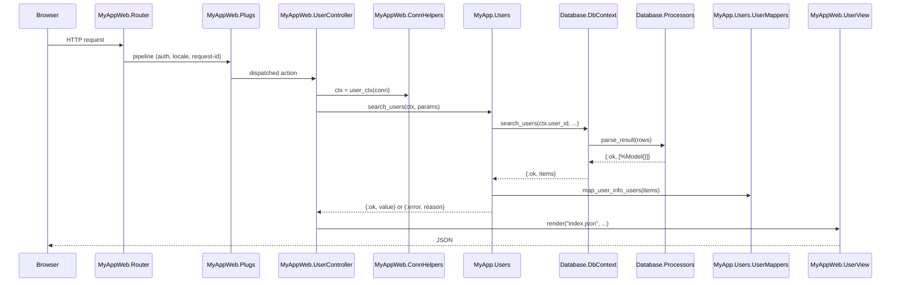

# Elixir coding guidelines

The Bliss Framework's [general coding guidelines](../coding-guidelines/index.md) were written for application services. Elixir — built on Erlang's actor model, with Phoenix's "contexts" already shaping the application — fits the trio (I/O → Management → Providers) very naturally, but it adds its own dialect: two top-level OTP modules (`MyApp` and `MyAppWeb`), a `UserContext` struct threaded as the first argument to almost every business call, autogenerated database wrapper modules, and tagged-tuple result shapes that determine control flow.

This section captures the adjustments specific to an Elixir/Phoenix service the way we build them at KeenMate: Phoenix contexts as Management, one wrapper module per stored function as Providers, structs in `Models.*` as the typed boundaries, the [`:result`](https://hex.pm/packages/result) package as the unified return shape (constructors and combinators on top of plain tagged tuples), and the conventions that keep a multi-thousand-function codebase navigable.

Read the [general coding guidelines](../coding-guidelines/index.md) and [general naming conventions](../coding-guidelines/general-naming-conventions.md) first — everything here builds on them. We also assume the [official Elixir style guide](https://hexdocs.pm/elixir/naming-conventions.html) and `mix format` defaults as the baseline; this page only covers the points where Bliss adds or constrains a rule.

## What's different from a typical Bliss service

| Topic | C# / generic service | Elixir / Phoenix |
|-------|----------------------|------------------|
| Runtime | One process per app, threads inside | BEAM — thousands of lightweight processes, supervised in trees |
| Top-level module | One namespace (`MyApp.*`) | **Two**: `MyApp.*` (business) and `MyAppWeb.*` (HTTP/Channels/I/O) |
| Layering | I/O → Management → Providers as folders/projects | Same trio: `MyAppWeb.*Controller` → Phoenix contexts (`MyApp.<Subject>`) → `Database.DbContext` and external clients |
| Identifiers | PascalCase / camelCase | `snake_case` everywhere; modules are `PascalCase` aliases of underscored filenames |
| Errors | Exceptions with types | Tagged tuples `{:ok, value}` / `{:error, reason}` via the [`result`](https://hex.pm/packages/result) package — always constructed with `Result.ok/1` / `Result.error/1`, composed with `Result.map/2` / `Result.and_then/2` / `Result.map_error/2`. Library structs (`%Postgrex.Error{}`, `%Ecto.Changeset{}`) never escape a context. Never raise across a context boundary. See [Result type and error handling](#result-type-and-error-handling). |
| Validation | Often inside services | At the I/O layer (controller) and at the boundary of each context function |
| State | Request-scoped or service-scoped | Mostly request-scoped data + supervised stateful processes (`GenServer`, `GenStage`, PubSub, ETS caches) |
| User identity | DI-injected `ICurrentUser` | `UserContext.t()` struct built once by the controller and passed as the **first argument** to every context call |
| "Side layer" | Models, Helpers, Mappers, Constants | `Models.*`, `Helpers.*`, `<Context>.<Subject>Mapper`, `<App>.Consts` (memoized) |
| Pub/sub | Message bus | `Phoenix.PubSub`, one named instance per domain (`MyApp.PubSub`, `Notifications.PubSub`, …) started in the supervision tree |
| Background work | Hosted services / queues | `Task.Supervisor`, `GenStage`, `Memoize` with TTL, periodic supervised workers |

## What stays the same

These Bliss principles apply unchanged:

1. **[Be replaceable](../consistency-is-bliss.md#be-replaceable)** — your contexts, your structs, your function signatures. A future maintainer should be able to read a context module cold and know what it does. Don't lean on cleverness that only the original author understands.
2. **[Ubiquitous Language](../learning-guidelines/basic-principles.md#domain-driven-development)** — `user`, `tenant`, `permission`, `group` mean the same thing in `auth.user_info` (DB), `Database.DbContext.auth_get_user_by_id/2`, `MyApp.Users`, the `/api/users` endpoint, and `Users.svelte`. The general rule that a database table is singular while a collection-shaped function/endpoint is plural is the same here: `MyApp.Users.get_user/2`, `MyApp.Users.search_users/3`.
3. **[DRY](../learning-guidelines/basic-principles.md#dont-repeat-yourself)** — pagination metadata lives in one `BaseMapper.new_paged_results/3`, not re-implemented per context. Logging shape lives in one `Helpers.LoggingHelpers` macro. Lookup data lives in one memoized `Consts` module.
4. **[Use only what you need](../learning-guidelines/basic-principles.md#use-only-what-you-need)** — no premature `GenServer`, no premature `Supervisor`, no premature `Protocol`. A function that maps one struct does not need a `Behaviour`. Add the abstraction only when a second caller appears.
5. **[Restrain yourself](../key-elements.md#restrain-yourself)** — one verb registry, one [result type](#result-type-and-error-handling) (the `:result` package), one logging shape, one way of building the `UserContext`. Pick once, apply everywhere. Elixir's flexibility makes this rule especially load-bearing — without it, every caller pays for every callee's shape choices.
6. **Side layer purity** — `Models.*`, `Helpers.*`, and `Database.Models.*` carry no dependencies on contexts or on the web app. They could be lifted into a separate umbrella application tomorrow.

## The two-OTP-app split

Every Phoenix service we ship has two top-level modules under `lib/`:

```
lib/
├── my_app/                              # The business application
│   ├── application.ex                   # Supervision tree
│   ├── repo.ex                          # Ecto.Repo
│   ├── consts.ex                        # Memoized lookup loaders
│   ├── users/                           # One folder per business subject
│   │   ├── users.ex                     # Context module — Management layer
│   │   ├── user_mappers.ex              # Side layer / Mappers
│   │   └── pub_sub.ex                   # Domain-specific PubSub topics
│   ├── locations/
│   │   ├── locations.ex
│   │   └── locations_mapper.ex
│   └── base_mapper.ex                   # Shared mapper helpers
│
├── my_app_web/                          # The HTTP/Channels application
│   ├── endpoint.ex
│   ├── router.ex
│   ├── controllers/                     # I/O layer — thin wrappers
│   ├── views/                           # JSON view modules
│   ├── plugs/                           # Cross-cutting request middleware
│   ├── auth/                            # Authentication-specific I/O
│   └── helpers/                         # Web-only helpers (Conn, JSON, HTML)
│
├── database/                            # Generated provider layer
│   ├── db_context.ex                    # One function per stored proc — Providers
│   ├── models/                          # One struct per stored-proc result row
│   └── processors/                      # One result parser per stored proc
│
├── models/                              # Cross-cutting structs (Side layer)
│   ├── user_context.ex
│   ├── ad_user.ex
│   └── ident/user.ex
│
└── helpers/                             # Cross-cutting helpers (Side layer)
    ├── date_helpers.ex
    ├── string_helpers.ex
    ├── logging_helpers.ex
    └── ...
```

`MyAppWeb.*` may call `MyApp.*` freely, but **never** the reverse — the business app must not know there is an HTTP layer above it. The only exception is a few `MyAppWeb.*Helpers` (e.g. `GeoHelpers`) that contain pure transformations and are aliased by contexts; treat those as Side layer, not as I/O.

## Layering, in Elixir terms

The three-layer Bliss model expressed as Elixir modules:



- **`MyAppWeb.*Controller`** = **I/O**. The boundary. Builds `ctx`, calls one context function, renders. Action body is usually three to ten lines. Errors fall through to `action_fallback MyAppWeb.FallbackController`.
- **`MyAppWeb.Plugs.*`** = **I/O / boundary middleware**. Authentication, locale resolution, request-id assignment, rate limiting, CORS. Each plug does one thing.
- **`MyApp.<Subject>`** (e.g. `MyApp.Users`, `MyApp.Locations`) = **Management**. The Phoenix context. Receives `ctx` + plain inputs, orchestrates one or more provider calls, runs the mapper, returns the result struct/tuple. **Never** calls another context's internals directly — if two contexts genuinely need to share, extract a helper or a Side layer module.
- **`Database.DbContext`** = **Providers (database)**. Autogenerated by `db-gen`. One function per stored procedure, mirroring the SQL function signature. Never call `Repo.query` directly from a context — go through `DbContext`.
- **`MyApp.<Subject>.GraphApi`, `MyApp.<Subject>.Redis`, `MyApp.<Subject>.Mailer`, `MyApp.ExternalAddressesProviders`** = **Providers (external)**. One module per external system. Same contract as `DbContext`: a context calls it, gets a tuple back.
- **`Models.*`**, **`Database.Models.*`**, **`<Context>.<Subject>Mapper`**, **`Helpers.*`**, **`MyApp.Consts`** = **Side layer**.

The "providers don't talk to other providers" rule from the [general guidelines](../coding-guidelines/layers-of-application.md#providers-layer) holds: `DbContext` does not call `GraphApi`, `GraphApi` does not call `Mailer`. Orchestration lives in the context.

### Controllers stay thin

A controller action does four things and nothing else:

```elixir
defmodule MyAppWeb.LocationController do
  use MyAppWeb, :controller

  alias MyApp.Locations

  action_fallback MyAppWeb.FallbackController

  def index(conn, params) do
    ctx = user_ctx(conn)

    with {:ok, locations} <- Locations.search_locations(ctx, params) do
      render(conn, "index.json", locations: locations)
    end
  end
end
```

That's the shape. If a controller action grows past ~15 lines or starts touching `DbContext`, the work belongs in the context. Use `action_fallback` so error tuples (`{:error, :not_found}`, `{:error, :validation_failed}`, …) are translated to HTTP responses in **one** place.

### Contexts orchestrate, mappers shape, providers do

A context function follows the same shape every time: validate or transform inputs if needed, call one or more providers, branch on the result, hand off to a mapper, log + tag on error, return.

```elixir
def search_locations(ctx, search_text, address_filters, search_filters, page, page_size) do
  DbContext.search_locations(
    ctx.user_id, ctx.locale,
    search_text, address_filters,
    %{"tags" => search_filters[:search_tags]},
    page, page_size
  )
  |> case do
    {:ok, items} ->
      LocationsMapper.map_items(items, page_size)

    {:error, reason} ->
      Logger.error("Error occurred while searching locations",
        reason: inspect(reason),
        detail: inspect_user_action(:search_locations)
      )

      Result.error(:search_locations_error)
  end
end
```

Three things to notice:

1. **`ctx` is the first argument** — always. Even if the function doesn't use every field today, the next variant will.
2. **`|> case do`** — pipe into a case for a single provider call; `with` chains for multi-step orchestrations. Pick the shape that reads cleanest; don't mix in the same function.
3. **Errors are logged with `inspect(reason)` and `inspect_user_action(:atom)`** — the `Helpers.LoggingHelpers` macro pulls `ctx.user_id` and `ctx.username` from the surrounding scope automatically. This is the project-wide log shape; do not invent a new one per context.

### Providers stay mechanical

The `Database.DbContext` module is autogenerated from the SQL function catalogue (`db-gen`). **Do not hand-edit it.** If you need a new provider call, add the SQL function and regenerate. Each call is a thin wrapper that:

1. Builds the parameter list, filtering out `:eg_value_not_provided` sentinels (the way Elixir expresses "this optional SQL parameter was omitted").
2. Executes the query through `MyApp.Repo`.
3. Hands the raw rows to a `Database.Processors.*Processor` to parse into typed structs.
4. Returns `{:ok, [%Model{}]}` or `{:error, reason}`.

External-system providers (HTTP clients, mail, Redis, AAD/Graph) follow the same return contract — `{:ok, value}` or `{:error, reason}` — so contexts can compose them with `with` without caring whether the provider is a DB call or an HTTP call.

## The `UserContext` rule

Every business operation has an actor and a request. We capture both in one struct and pass it as the first argument to every context-level function:

```elixir
defmodule Models.UserContext do
  @enforce_keys [:user_id, :username]
  defstruct [
    :user_id, :user_oid, :username, :user,
    :ip, :user_agent, :origin,
    :locale, :request_id
  ]

  @type t() :: %__MODULE__{...}

  def system_ctx(username \\ "system"), do: %__MODULE__{user_id: 1, username: username || "system", ...}
end
```

- **Built in the controller** by `MyAppWeb.ConnHelpers.user_ctx/1` (or `anonymous_ctx/1` for unauthenticated calls). Never built in a context.
- **System actor**: when a background process or another context needs to act without an authenticated user (cache warm-up, scheduled job, internal recalc), call `UserContext.system_ctx()`. `user_id: 1` is reserved across all our apps for the system actor — see the [PostgreSQL multi-tenant rule](../coding-guidelines-postgres/index.md#multi-tenant-access-pattern).
- **`request_id` flows end-to-end** — pulled from `Logger.metadata`, attached to every outbound HTTP header (`X-Correlation-ID`), included in every log line. This is the Elixir-side of the [PostgreSQL `_correlation_id`](../coding-guidelines-postgres/index.md#audit-journal-and-notifications) story.
- **`ctx` is the first argument everywhere** — including private helpers within a context. Don't reach for module attributes or process dictionary; pass the context. If a function genuinely doesn't need `ctx`, that is a hint it belongs in `Helpers.*` or in a mapper.

## Side layer

### Models — `Models.*` and `Database.Models.*`

Two flavours, same rules:

- **`Models.*`** — hand-written cross-cutting structs (`UserContext`, `ADUser`, `Ident.User`). Define `defstruct`, `@enforce_keys` for required fields, `@type t() :: %__MODULE__{...}`. No logic beyond constructors.
- **`Database.Models.*`** — autogenerated, one per stored-procedure result row. Always `@derive Jason.Encoder` (so a controller can hand them straight to a JSON view), always `use Accessible` (so callers can use `model[:field]` syntax), always a `t()` typespec.

```elixir
defmodule Database.Models.AuthGetUserByIdModel do
  @fields [:user_id, :code, :uuid, :username, :email, :display_name]
  @enforce_keys @fields

  @derive Jason.Encoder
  defstruct @fields

  @type t() :: %__MODULE__{...}

  use Accessible
end
```

Models carry no behaviour, no validation, no defaults beyond the trivial. They are vessels. See [Models in the general guide](../coding-guidelines/layers-of-application.md#models).

### Mappers — one per subject, plus a `BaseMapper`

Every context that returns shaped data has a sibling `<Subject>Mapper` module:

- `MyApp.Locations` → `MyApp.Locations.LocationsMapper`
- `MyApp.SourceAddresses` → `MyApp.SourceAddresses.SourceAddressesMapper`
- `MyApp.Users` → `MyApp.Users.UserMappers` (plural when the module covers several map shapes)

Mappers have **no logic of their own** — no DB calls, no logger, no `ctx`. They take raw rows from a provider and produce the shape the controller renders. Pagination metadata, geometry decoding, and timestamp templating are factored into `MyApp.BaseMapper`:

```elixir
def map_items(items, page_size) do
  items |> BaseMapper.new_paged_results(&map_item/1, page_size)
end

def map_item(item) do
  Map.take(item, ~w(location_id title tags employee_count)a)
  |> Map.merge(%{
    location_type: %{code: item.location_type_code, title: item.location_type_title},
    primary_address: %{...}
  })
end
```

See [Mappers in the general guide](../coding-guidelines/layers-of-application.md#mappers).

### Helpers — `Helpers.*`

Cross-cutting pure utilities live in `lib/helpers/`, namespaced under `Helpers.*` regardless of the app: `Helpers.DateHelpers`, `Helpers.StringHelpers`, `Helpers.MapHelpers`, `Helpers.LoggingHelpers`. Web-only helpers live under `MyAppWeb.*Helpers` (`ConnHelpers`, `JsonHelpers`, `HtmlHelpers`) because they take a `Plug.Conn`.

The same "no internal state, no side effects beyond what's obvious from the name" rule from the [general guide](../coding-guidelines/layers-of-application.md#helpers) applies. If a function in `Helpers.*` ever reaches for `Application.get_env`, makes an HTTP call, or hits a database — it does not belong in `Helpers.*`.

### Constants and lookups — `Consts` with `Memoize`

Reference data (lookup tables fetched from the DB) lives in a single `MyApp.Consts` module that wraps `DbContext.const_*` calls with `Memoize.defmemo` and a TTL:

```elixir
@common_expiration :timer.seconds(60)

defmemo get_business_units(), expires_in: @common_expiration do
  case DbContext.const_get_business_units() do
    {:ok, items}    -> Result.ok(items)
    {:error, reason} ->
      Logger.error("Error occurred while getting business_units", reason: inspect(reason))
      Result.error(:get_business_units_error)
  end
end
```

The Elixir equivalent of the [`const.*` schema](../coding-guidelines-postgres/index.md#schema-shaped-layering) on the PostgreSQL side. Locale-dependent lookups take `locale` as part of the memo key; user-dependent ones use `Memoize.Cache.get_or_run/2` with a composite key.

## Configuration

Configuration is layered, with three distinct concerns separated:

1. **Compile-time, checked-in defaults** — `config/config.exs` and `config/<env>.exs` (`dev.exs`, `test.exs`, `prod.exs`).
2. **Per-developer overrides, never committed** — `config/.local.exs` and `config/<env>.local.exs`.
3. **Runtime, environment-driven values** — `config/runtime.exs`, loaded after compilation, before the supervision tree starts.

### The four-tier load order

`config/config.exs` ends with three import lines, in this exact order:

```elixir
# Import environment specific config. This must remain at the bottom
# of this file so it overrides the configuration defined above.
import_config "#{config_env()}.exs"

File.regular?("config/.local.exs") && import_config(".local.exs")
File.regular?("config/#{config_env()}.local.exs") && import_config("#{config_env()}.local.exs")
```

That gives four layers, each overriding the previous:

| Layer | File | Checked in? | Purpose |
|-------|------|-------------|---------|
| 1. Project defaults | `config/config.exs` | Yes | Cross-environment defaults, shared structure, integrations that don't vary per environment |
| 2. Environment | `config/dev.exs` / `test.exs` / `prod.exs` | Yes | What differs by environment but is the same for every developer / deploy in that environment |
| 3. Machine-global overrides | `config/.local.exs` | **No** (gitignored) | Per-developer values that apply to every environment (e.g. a personal DB password used in dev *and* test) |
| 4. Machine + environment overrides | `config/dev.local.exs` / `prod.local.exs` / ... | **No** (gitignored) | Per-developer values for one specific environment (the most common shape) |

Both `.local.exs` variants are loaded with `File.regular?(...) && import_config(...)`. The `File.regular?/1` guard means a missing file is silent — checking out a fresh clone still boots, even though no `.local.exs` exists yet.

`.gitignore` must include both patterns so an absent-minded `git add config/` cannot leak overrides:

```gitignore
config/.local.exs
config/*.local.exs
```

### What belongs in `.local.exs` vs `runtime.exs`

These two mechanisms exist for different reasons; don't mix them.

| Goes in `.local.exs` | Goes in `runtime.exs` |
|----------------------|-----------------------|
| The thing only **this developer's machine** needs | The thing every **deploy** needs to reconfigure without recompile |
| Local DB credentials, local Redis port, local SMTP relay you use for testing | Production DB credentials, production Redis, production SMTP |
| A locally checked-out shared library overridden via `path:` in `mix.exs` | Endpoint URL/port, secret key base |
| Personal Azure / AAD app registration for local OIDC | Production AAD client ID / secret / tenant |
| A locally-running FastAPI on a non-default port | Feature flags that should flip per deployment |
| Pointing `cors_plug` at your front-end dev server | External service URLs (Graph API, Nominatim, FastAPI) |

The rule of thumb: if checking the value into git would force every other developer to either also have your value, or to override it locally, it belongs in `.local.exs`. If the value needs to differ between staging and production deploys of the same compiled release, it belongs in `runtime.exs`.

### Sentinels for "you must override this"

Checked-in config files use `"FILL_ME_UP"` as a sentinel string for values every deployment must override:

```elixir
config :dhl_locations_factory_backend, :openid_connect_providers,
  aad: [
    discovery_document_uri: "https://login.microsoftonline.com/{FILL_ME_UP}/v2.0/.well-known/openid-configuration",
    client_id: "FILL_ME_UP",
    client_secret: "FILL_ME_UP",
    ...
  ]
```

`FILL_ME_UP` is greppable across the codebase, never matches a real value, and produces an obvious failure if someone forgets to override it. It is the Elixir analogue of the SQL `error.raise_NNNNN` story: one well-known sentinel that means "this must be replaced". Pick the same sentinel project-wide.

### `runtime.exs` — production reconfiguration

`runtime.exs` runs **after compilation, before the supervision tree starts**, and is the only config file that runs inside an OTP release. Everything we want to reconfigure between deploys lives here.

The whole interesting block is wrapped in `if config_env() == :prod do` — dev and test get their values from `dev.exs` / `test.exs` / `.local.exs`:

```elixir
import Config

if config_env() == :prod do
  db_hostname =
    System.get_env("DB_HOSTNAME") ||
      raise """
      environment variable DB_HOSTNAME is missing.
      For example: MAIN_DB_SERVICE_HOST
      """

  config :my_app, MyApp.Repo,
    hostname: db_hostname,
    username: System.fetch_env!("DB_USERNAME"),
    password: System.fetch_env!("DB_PASSWORD"),
    database: System.fetch_env!("DB_DATABASE"),
    pool_size: String.to_integer(System.get_env("POOL_SIZE") || "10")

  ...
end
```

Four things to notice:

1. **One env-var-reading style per required-ness shape.** Three patterns, used consistently:

    | Pattern | When |
    |---------|------|
    | `System.fetch_env!("FOO")` | Required, terse failure (raises `ArgumentError`) — fine for self-evident names |
    | `System.get_env("FOO") \|\| raise """..."""` | Required, with a hand-written error message explaining what the value looks like — preferred for non-obvious vars |
    | `System.get_env("FOO", "default")` | Optional, with a hardcoded fallback |
    | `System.get_env("FOO") \|> case do ... end` | Optional, with a transformation when present (CSV splits, integer parses) |

    The custom `|| raise """..."""` shape is the project default for the high-signal required vars — it includes an example value in the error message so a deploy operator who hits the failure knows immediately what to set.

2. **All values that need to vary per deploy live in `runtime.exs`.** Database, Redis, OIDC client + secret, endpoint host/port, secret key base, mailer credentials, external API URLs and keys, CORS origins, feature toggles, formats, fonts — every one. Compile-time `prod.exs` should be nearly empty, holding only configuration that genuinely cannot change at runtime (CSP headers, logger format).

3. **Parse-and-validate at boot, not at use.** `String.to_integer(...)` on a port value happens in `runtime.exs`, not in the supervisor that consumes it. If `POOL_SIZE=potato`, we want the release to fail at boot with a clear message — not the first time someone opens a DB connection.

4. **`runtime.exs` runs *after* compilation.** Anything that affects compiled bytecode (module attributes computed from config, `@otp_app`, dialyzer types) must stay in `config.exs` / `<env>.exs`. The `runtime.exs` docstring comment from the Phoenix generator says this — keep that comment in place; it is a reminder to future-you, not boilerplate.

### Reading config at runtime

Three idiomatic shapes for reading config inside the application; pick by required-ness:

```elixir
# Required — raise at the read site if missing. Use when the absence is a deploy bug.
Application.fetch_env!(:my_app, :graph_api_field_mapping)

# Optional — returns nil if missing.
Application.get_env(:dhl_locations_factory_backend, :httpoison_options)

# Optional with default at the call site.
Application.get_env(:my_app, :http_proxy, [])
```

Read config **at the point of use**, not at compile time, unless there is a measurable hot-path reason. Reading via `@compile_time_value Application.compile_env(...)` is appropriate for values consumed inside macros or guards; for everything else, runtime reads are simpler and survive `runtime.exs` overrides.

## Supervision and processes

The supervision tree is declared in `MyApp.Application.start/2`. Order it from most-fundamental to most-dependent:

```elixir
children = [
  MyApp.Repo,
  redis_app(),
  MyAppWeb.Telemetry,
  pubsub_spec(MyApp.PubSub),
  pubsub_spec(Notifications.PubSub),
  GraphApi.Supervisor,
  {Task.Supervisor, name: Communications.TaskSupervisor},
  {PlugAttack.Storage.Ets, name: MyAppWeb.PlugRateLimit.Storage, clean_period: 60_000},
  MyAppWeb.Endpoint
]
```

- **One `Phoenix.PubSub` per domain**, not one shared bus. `MyApp.PubSub` for the application itself, `Notifications.PubSub` for the notification subsystem, `ChangeRequests.PubSub` for the change-request workflow. Each domain owns its topics.
- **Stateful workers (`GenServer`, `GenStage`, ETS owners) are always supervised.** No bare `GenServer.start_link` outside the supervision tree.
- **`Task.Supervisor`** for fire-and-forget work that should not crash the caller (outbound email, audit writes, fan-out notifications). Name them by purpose (`Communications.TaskSupervisor`).
- **External-API supervisors** (`GraphApi.Supervisor`) own their own child specs — token caches, request poolers, retry workers. Don't scatter those into the top-level tree.

!!! warning "Don't cross the streams (again)"

    The Bliss rule that providers don't call providers applies inside the supervision tree too. A `GenServer` that wraps an external API is a Provider — it must not reach into another provider's process to "borrow" a connection or piggy-back on its retry logic. If two providers need to share state, that state belongs in a Side layer module (an ETS table owned by a small dedicated `GenServer`, or `:persistent_term` for read-mostly config).

## Result type and error handling

This is the single most consequential decision in an Elixir codebase. Get it wrong and every caller does it differently; get it right and every layer can compose, log, and translate results uniformly.

### The problem: tagged tuples are a convention, not a contract

Elixir's built-in shape for "I might succeed or fail" is the tagged tuple — `{:ok, value}` / `{:error, reason}`. The language and `with` make this idiomatic, but the **contract is unenforced**. Across a real codebase you will see, for the same logical operation:

```elixir
:ok                             # success, no value
{:ok}                           # success, no value — but as a 1-tuple
{:ok, nil}                      # success, value happens to be nil
{:ok, []}                       # success, empty list
{:ok, [item]}                   # success, exactly one row
{:ok, :no_data}                 # success, but the value is "no data"
{:ok, %Postgrex.Result{}}       # success, raw library struct leaked
{:ok, data, metadata}           # success, with side-channel info
{:error, :not_found}            # failure, atom reason
{:error, "User missing"}        # failure, string reason
{:error, %Ecto.Changeset{}}     # failure, raw library struct leaked
{:error, %{code: "x", msg: "y"}}# failure, ad-hoc map
{:error, {:validation, [errs]}} # failure, nested tuple
```

Every caller has to handle every shape any of its providers can return. The combinatorics explode at every layer. Pattern matching becomes guesswork. `with` chains gain extra clauses for shapes that "shouldn't happen but did". This is the cost of an unenforced contract.

The Bliss answer is **library-enforced discipline on tagged tuples**: use the `:result` package's constructors (`Result.ok/1`, `Result.error/1`) and combinators (`Result.map/2`, `Result.and_then/2`, `Result.map_error/2`, …) everywhere, and never write raw `{:ok, _}` / `{:error, _}` literals in your own code. The tuples stay — every Hex library produces them — but in your code they only ever come out of one of the library's named constructors, which gives you the same de-facto contract as a struct would, without paying the interop translation tax.

### The Bliss default: the [`result`](https://hex.pm/packages/result) package

```elixir
# mix.exs
{:result, "~> 1.7"}
```

What you get:

```elixir
Result.ok(42)                  # => {:ok, 42}
Result.error(:not_found)       # => {:error, :not_found}

Result.ok?({:ok, 42})          # => true
Result.error?({:error, :x})    # => true

Result.map({:ok, 5}, & &1 * 2)               # => {:ok, 10}
Result.map_error({:error, :x}, & "err: #{&1}") # => {:error, "err: x"}

Result.and_then({:ok, 5}, fn n -> {:ok, n + 1} end)   # => {:ok, 6}
Result.and_then({:error, :x}, fn n -> {:ok, n + 1} end) # => {:error, :x}  (short-circuit)

Result.with_default({:ok, 5}, 0)     # => 5
Result.with_default({:error, :x}, 0) # => 0

Result.catch_error({:error, :timeout}, :timeout, fn _ -> {:ok, :retried} end)
# => {:ok, :retried}

@spec my_fun(...) :: Result.t(error_type, value_type)
```

Plus `Result.fold/1`, `Result.from/2`, `Result.perform/2` (side-effect tap), `Result.resolve/1` (flatten), `Result.retry/4`, and combinator algebra (`Result.product/1`, `Result.sum/1`, `Result.r_and/2`, `Result.r_or/2`). Submodules `Result.Ok.of/1` and `Result.Error.of/1` exist as algebraic-data-type-style constructors for the FP-style reader and for passing as `&Result.Ok.of/1` function references — they delegate to the flat `Result.ok/1` / `Result.error/1` and produce the same tuples.

### Why a library and not just raw tuples

Two reasons:

1. **One named place for every operation.** When everyone writes `Result.ok(value)` instead of `{:ok, value}`, code review can spot a raw tuple literal as a smell. A grep for `Result.ok` enumerates every success path; a grep for `{:ok,` enumerates every success path AND every Ecto/Postgrex/HTTPoison call AND every test fixture. The naming gives you a search index for free.
2. **Combinators eliminate hand-written `case` ladders.** A pipeline of three transformations on a result becomes `Result.map(...) |> Result.and_then(...) |> Result.map_error(...)` — three lines, each named for what it does. The same logic spelled out with `case` is fifteen lines with three places where the wrong tuple shape can slip in.

### What goes inside `{:ok, _}` — the shape rules

The success payload is rule-bound by operation class. The library can't enforce this — we do, by convention:

| Operation class | Shape inside `{:ok, _}` | Empty case |
|-----------------|--------------------------|------------|
| `get_*` returning one entity | The mapped entity (a struct or map) | `{:error, :<entity>_not_found}` — not `{:ok, nil}` |
| `get_*` returning many entities (unpaged) | A list of mapped entities | `{:ok, []}` — empty is success |
| `search_*` (paged) | A map: `%{items: [...], count: n, pages: p, page_size: s}` | `{:ok, %{items: [], count: 0, pages: 1, page_size: N}}` |
| `create_*` | The new entity, or `%{<entity>_id: id}` when only the id matters | n/a |
| `update_*` / `delete_*` / `set_*_as_*` | `nil` — use `Result.ok(nil)` or the bare `:ok` atom if your project uses that | n/a |
| `ensure_*` | The (existing or newly created) entity | n/a |
| Pure side-effect (notify, broadcast, clear) | `nil` | n/a |
| Predicate-style with a `Result.t()` return | `boolean()` | n/a — `Result.ok(true)` / `Result.ok(false)` |

Three rules fall out:

1. **`{:ok, nil}` means "the operation produced no value worth returning"** — typical for update/delete/notify. Pick one convention per project for "no-payload success": either always `Result.ok(nil)` (tuple form) or always bare `:ok` (atom form). Don't mix.
2. **"Entity not found on a `get_one`" is an error, not `{:ok, nil}`.** A missing entity is a domain outcome the caller must handle explicitly; folding it into a nullable success forces every caller to add an `is_nil(data)` check.
3. **Empty collections on a `get_many`/`search_*` are success.** `{:ok, []}` is a perfectly good answer to "give me all permissions" — zero is a real count.

For pagination, prefer **putting metadata inside `data` as a map** (`%{items: [...], count, pages, page_size}`) over the three-tuple `{:ok, data, metadata}` shape. The three-tuple is sometimes seen in the wild (and the legacy `Simplificator3000.Result.wrap/1` understood it), but it breaks every standard combinator — `Result.map/2`, `Result.and_then/2`, and the rest of `:result`'s API only deal with two-tuples. A map inside `data` composes cleanly.

### What goes inside `{:error, _}` — the reason

A **call-site-specific atom** in the common case. Three rules:

1. **Atom is the default shape.** `Result.error(:not_found)`, `Result.error(:ga_already_used)`. Never a string (`{:error, "User missing"}` — can't be pattern-matched safely). Never a raw library struct (`{:error, %Ecto.Changeset{}}` — leaks DB types past the boundary).
2. **Named in the caller's vocabulary**, not the underlying mechanism. `:ga_already_used` is what the caller cares about; `:unique_violation` is a Postgres detail. `:search_locations_error` over `:db_error`.
3. **When you need structured context**, use a `{reason_atom, metadata_map}` two-tuple inside the error tuple — and only when the caller actually destructures it. Don't add it speculatively.

```elixir
Result.error(:not_found)
Result.error({:not_found, %{user_id: id}})
Result.error({:validation_failed, %{errors: changeset_errors}})
```

The shape `{:error, atom}` is the default; `{:error, {atom, map}}` is the escape hatch when one caller needs to act on the metadata. If you find yourself reaching for `{:error, {atom, map}}` everywhere, you're probably putting context where it belongs in a log line instead.

### The interop boundary rule

Third-party libraries (`Ecto`, `Postgrex`, `HTTPoison`, `Req`, `Swoosh`, `Redix`, `OpenIDConnect`, every `gen_*`/`ex_*` package on Hex) return tagged tuples plus their own structs as error payloads. We cannot make Hex change; we contain the inconsistency at one layer:

- **Providers** (`Database.DbContext.*`, `MyApp.<Subject>.GraphApi`, `MyApp.Communications.Mailer`, `MyApp.Users.Redis`) return raw tagged tuples — they wrap libraries that speak that way. Their `@spec` says `{:ok, [%Model{}]} | {:error, term()}` and that's the contract. Inside a provider, raw `{:ok, _}` / `{:error, _}` literals are fine.
- **Contexts** translate provider results to the Bliss shape using `Result.ok/1` / `Result.error/1` and the `:result` combinators. The translation step is where you turn a `%Postgrex.Error{}` into a domain atom, a `%Ecto.Changeset{}` into `{:validation_failed, %{errors: ...}}`, a `%HTTPoison.Error{}` into `:<service>_unavailable`.
- **Controllers** see only the result of a context call — `{:ok, value}` or `{:error, atom}`. They never pattern-match on a `%Postgrex.Error{}` or any other library struct, because those never escape the context.

`%Postgrex.Error{}`, `%Ecto.Changeset{}`, `%HTTPoison.Error{}` never escape the context. The fallback controller has one job: turn `{:error, :not_found}` into a 404, `{:error, :validation_failed}` into a 422, and so on — atom by atom.

### Composing results — `Result.and_then/2` over `case`

The Elixir `with` macro works fine with `:result` tuples (they're just tagged tuples). Two equivalent ways to chain:

```elixir
# Option A: `with` — short and familiar
with {:ok, user}  <- Users.get_user(ctx, user_id),
     {:ok, perms} <- Permissions.get_permissions(ctx, user.user_id) do
  Result.ok(%{user: user, permissions: perms})
end
```

```elixir
# Option B: pipeline with combinators — short-circuits on first error
Users.get_user(ctx, user_id)
|> Result.and_then(fn user ->
  Permissions.get_permissions(ctx, user.user_id)
  |> Result.map(fn perms -> %{user: user, permissions: perms} end)
end)
```

Pick by readability. `with` is more familiar to Elixir-first readers and handles multi-result destructuring nicely. The pipeline form is shorter for linear chains and stays in pipe-style — useful when the rest of the context function is already a pipeline.

Other useful combinators:

```elixir
result |> Result.map(&transform/1)            # pure transform on success
result |> Result.map_error(&translate/1)      # rewrite the error reason
result |> Result.and_then(&fallible_step/1)   # railway: step that itself returns a Result
result |> Result.with_default(default_value)  # extract or fall back
result |> Result.perform(&log_it/1)           # side effect, value passes through unchanged
result |> Result.catch_error(:timeout, &retry/1)  # selective recovery from one reason
```

The point of preferring combinators over hand-written `case` ladders is the same as preferring `Enum.map/2` over a recursive `def loop`: the named operation tells the reader what's happening; the manual version has the same shape but more places to get it wrong.

### Five rules, in summary

1. **No `raise` across a context boundary.** Inside a context you may `raise` for "this should never happen" assertion failures (catastrophic invariant breaks), but the public function returns a result tuple. Controllers must never `try/rescue` around a context call.
2. **Use `:result` constructors and combinators, never raw tuple literals in new code.** `Result.ok(value)` over `{:ok, value}`; `Result.map/2` and `Result.and_then/2` over hand-written `case`. Raw tuples are allowed inside providers (where you're wrapping a library) and at pattern-match sites (where you're destructuring) — but never as the *output* literal you write.
3. **The success payload follows the operation-class shape rules** above. `:no_data` / `:nothing` / `:empty` sentinel atoms inside `{:ok, _}` are forbidden; use `Result.ok(nil)` for no-payload operations and `Result.error(:<thing>_not_found)` for missing entities.
4. **Error reasons are call-site-specific atoms.** Strings, library structs, and ad-hoc nested tuples are out. Use `{atom, metadata_map}` only when a caller actually destructures the metadata.
5. **The interop boundary is the context.** Providers may return raw tagged tuples from third-party libraries; contexts translate to `:result` shapes; controllers see only `Result.t()` tuples. `%Postgrex.Error{}`, `%Ecto.Changeset{}`, `%HTTPoison.Error{}` never escape the context.

Postgres errors get the same treatment as every other library — match on the `pg_code` (your domain-specific 5-digit codes from [`error.raise_NNNNN`](../coding-guidelines-postgres/naming-conventions.md#error-functions-one-per-code)) at the context layer and translate to a domain atom:

```elixir
{:error, %Postgrex.Error{postgres: %{pg_code: "69101"}}} ->
  Result.error(:ga_already_used)
```

### Note on `Simplificator3000.Result`

Earlier KeenMate projects (including the DHL Location Factory reference) use `Simplificator3000.Result` — a struct-based `%Ok{}` / `%Error{}` design that predates this guidance. That module is **deprecated** as of `simplificator_3000` v1.0.0; new code uses `:result`. Existing projects can migrate at their own pace (the structs and the deprecated functions keep working), but no new projects should adopt `Simplificator3000.Result`. The architectural rules above were updated to match `:result`'s tagged-tuple model — the underlying discipline (operation-class shapes, atom-only reasons, interop boundary at the context) is the same; only the syntactic form differs.

## What this section covers

- [Naming conventions](./naming-conventions.md) — modules and namespaces (`MyApp` vs `MyAppWeb`), context vs subject filenames, structs and types, function names and the verb registry, parameter conventions (`ctx` first, the `:eg_value_not_provided` sentinel, optional arity), Mapper / Helper module shape, struct + `Accessible` rules, PubSub topic format, anti-patterns, and worked examples.
- This page also covers the [four-tier configuration layering](#configuration) (`config.exs` → `<env>.exs` → `.local.exs` → `<env>.local.exs`), the split between compile-time config and `runtime.exs`, the `FILL_ME_UP` sentinel, and the `System.fetch_env!` / `|| raise` / `System.get_env(default)` shapes for env-var reads.
- And the [unified result type](#result-type-and-error-handling) — the [`result`](https://hex.pm/packages/result) package as the Bliss default, the operation-class shape rules for what goes inside `{:ok, _}`, atom-only error reasons (with `{atom, metadata_map}` as the escape hatch), the interop boundary at the context layer, and the `Result.ok/1` / `Result.error/1` / `Result.map/2` / `Result.and_then/2` / `Result.map_error/2` family as the discipline that replaces raw tuple literals in new code.

## See also

- [General naming conventions](../coding-guidelines/general-naming-conventions.md) — the shared verb registry and the singular/plural rule that connects this layer to every other layer.
- [General coding structure](../coding-guidelines/layers-of-application.md) — the three-layer model and Side layer rules.
- [PostgreSQL coding guidelines](../coding-guidelines-postgres/index.md) — the sister page; the SQL function names you see in `Database.DbContext` are governed by it.
- [JavaScript / web-component guidelines](../coding-guidelines-javascript/index.md) — the front-end mirror of these rules.
