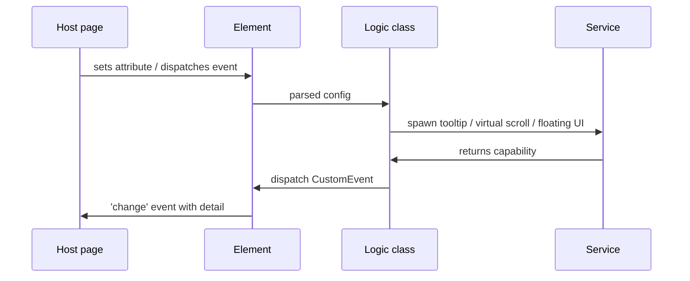

# JavaScript / web-component coding guidelines

The Bliss Framework's general coding guidelines were written with C# services and PostgreSQL databases in mind. JavaScript browser code — and especially **reusable component libraries** (web-components, Svelte components) — share most of those principles, but they live in a different shape: the DOM is the runtime, lifecycle is cooperative, framework idioms vary, and a library is consumed across host applications that you don't control.

This section captures the adjustments and additions specific to that world. Read the [general coding guidelines](../coding-guidelines/index.md) and [general naming conventions](../coding-guidelines/general-naming-conventions.md) first — everything here builds on them.

## What's different from a typical Bliss service

| Topic | C# / Elixir / PG service | JavaScript browser / component library |
|-------|--------------------------|----------------------------------------|
| Runtime | Long-lived process, you own the env | Browser, hosted in someone else's page |
| Layering | I/O → Management → Providers maps cleanly | Element → Logic class → Service classes (no Manager unless you really need one) |
| Errors | "Let it crash" → supervisor restarts | A library can't crash the host page — degrade or warn-once |
| File naming | `users-provider.cs` | `users-provider.ts`, `users-provider.test.ts`, `UserProfile.svelte` |
| Identifiers | PascalCase classes, PascalCase methods | PascalCase classes, **camelCase** methods, kebab-case files and HTML attributes |
| Visibility | Public API surface tightly controlled | Library has TWO public surfaces — programmatic exports AND HTML attributes / CSS variables |
| State | Often request-scoped | Long-lived per instance, with explicit `connect` / `disconnect` lifecycle |
| Validation | I/O layer rejects bad input | Custom-element attribute parsing must be defensive — host can pass anything |

## What stays the same

These Bliss principles apply unchanged:

1. **[Be replaceable](../consistency-is-bliss.md#be-replaceable)** — your code, your component API, your CSS prefix. Future-you reads the same library too.
2. **[Ubiquitous Language](../learning-guidelines/basic-principles.md#domain-driven-development)** — `option`, `value`, `selection`, `placement` mean the same thing across components.
3. **[DRY](../learning-guidelines/basic-principles.md#dont-repeat-yourself)** — magic strings (event names, attribute names, log categories) go to a constants table at the top of the module, never inline.
4. **[Use only what you need](../learning-guidelines/basic-principles.md#use-only-what-you-need)** — no premature interface, no premature manager, no fad library. Vendor a tiny dependency rather than absorb its transitive graph.
5. **[Restrain yourself](../key-elements.md#restrain-yourself)** — pick one async pattern, one event-handler shape, one callback suffix, and use them everywhere.
6. **Side layer purity** — models (`types.ts`), helpers (`logger.ts`, `dom-helpers.ts`), constants (`LOGGING_CATEGORIES`, `ATTRIBUTE_TABLE`) carry no dependencies on the rest of the component. They could be lifted into their own package tomorrow.

## Component-shaped layering

The three-layer Bliss model still applies, just under different names:

- **Element layer** (custom element or Svelte wrapper) = **I/O**. Parses attributes/props, hosts lifecycle (`connectedCallback`, `attributeChangedCallback`, `disconnectedCallback`, or Svelte mount/destroy), dispatches `CustomEvent`s. Translates between the DOM and the logic class.
- **Logic class** = **Management** (when justified) + **Provider** (the rendering/behavior provider). One class is fine for most components — the Bliss rule against premature Managers applies here too.
- **Service classes** (Tooltip, VirtualScroll, Floating-UI wrapper) = **Providers**. Single-purpose, don't call each other, accept inputs and return capabilities.
- **Side layer** = `types.ts` (models), `logger.ts` (helpers), `constants.ts`. Zero dependency on the layers above.

**Do not** invent a Manager that just wraps the logic class. The Element calling the logic class directly is the equivalent of the Bliss "I/O calls a Provider directly when Management would add no value" rule.

## What this section covers

- [Naming conventions](./naming-conventions.md) — casing, file names, custom-element tags, class suffixes, TS interface suffixes, callback vs handler vs listener, lifecycle verbs, DOM-specific verbs, HTML attribute ↔ config key mapping, boolean attribute semantics, vocabulary collisions, CSS-class naming cross-link to the web-components rulebook.

## See also

- [General naming conventions](../coding-guidelines/general-naming-conventions.md) — the shared verb registry (`Create`, `Update`, `Delete`, `Get`, `Search`, `Process`, `Map`, `Check`, …).
- [General coding structure](../coding-guidelines/layers-of-application.md) — the three-layer model and Side layer rules.
- BlissFramework component-library rulebook (`guidelines/web-components/`) — the canonical source on CSS structure, theming, color-scheme, and `--base-*` taxonomy. Lives outside the public site.
