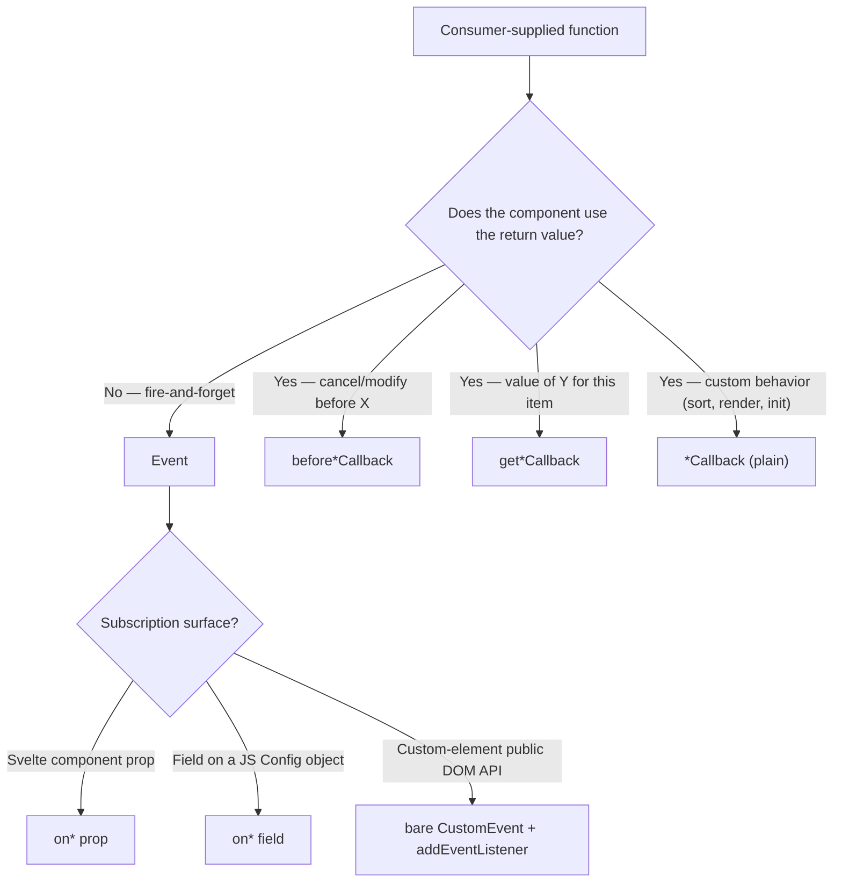

# JavaScript / web-component naming conventions

These rules extend the [general naming conventions](../coding-guidelines/general-naming-conventions.md). Where the general rules and these rules overlap, the general rule is canonical; this page adds the JavaScript- and DOM-specific cases that the general rules don't address.

## Casing summary

| Used for | Casing | Example |
|----------|--------|---------|
| Variables, function/method names, object keys | camelCase | `selectedOption`, `getItemValue()` |
| Classes, interfaces, types, enums, component classes | PascalCase | `WebMultiSelect`, `MultiSelectConfig`, `BadgesPosition` |
| File names (TS/JS source, CSS, tests) | kebab-case | `web-component.ts`, `multiselect.ts`, `dark-mode.css`, `users-provider.test.ts` |
| Svelte component files | PascalCase | `UserProfile.svelte`, `Ltree.svelte` |
| Custom-element tag names | kebab-case (with hyphen, mandatory) | `<web-multiselect>`, `<my-grid>` |
| HTML attributes | kebab-case | `show-checkboxes`, `data-options`, `badges-position` |
| URL path segments | kebab-case | `/api/users`, `/api/order-items` |
| CSS class names (BEM with component prefix) | kebab-case | `.ms__option--focused`, `.wg__cell--editable` |
| CSS custom properties | kebab-case with `--` prefix | `--ms-bg`, `--base-text-color` |
| Constants, enum values (when not native TS enum), env vars | SCREAMING_SNAKE_CASE | `MAX_LOGIN_ATTEMPTS`, `LOGGING_CATEGORIES` |
| TypeScript native `enum` members | PascalCase | `UserStatus.Active`, `BadgesPosition.Top` |

Why custom-element tag names **must** contain a hyphen: the HTML spec requires it (it's how the browser distinguishes a custom element from a built-in). Use your package prefix as the first segment when reasonable: `<web-multiselect>`, `<web-grid>`, not `<multiselect>`.

## File naming

| Kind | Rule | Example |
|------|------|---------|
| TS/JS source | kebab-case | `multiselect.ts`, `virtual-scroll.ts`, `web-component.ts` |
| TS type-only file | kebab-case | `types.ts`, `multiselect-types.ts` |
| TS declaration | matches source name | `multiselect.d.ts` |
| Test file | source name + `.test` or `.spec` | `multiselect.test.ts`, `users-provider.spec.ts` |
| End-to-end test | `.e2e` suffix or `e2e/` folder | `dark-mode.spec.ts` (inside `e2e/`) |
| Svelte component | PascalCase + `.svelte` | `Ltree.svelte`, `TreeNode.svelte` |
| CSS source (feature file) | kebab-case, one purpose per file | `controls.css`, `dark-mode.css`, `floating.css` |
| Public manifest / config | kebab-case | `component-variables.manifest.json` |

In a component library, the file that registers the custom element is conventionally `web-component.ts` (the "I/O wrapper") and the file with the framework-agnostic logic class is conventionally `<name>.ts` (`multiselect.ts`, `grid.ts`).

## Class naming

| Role | Suffix | Example |
|------|--------|---------|
| Framework-agnostic logic class | none, package-qualified | `WebMultiSelect`, `WebGrid` |
| Custom-element wrapper class | `Element` | `MultiSelectElement`, `WebGridElement` |
| Service class (single capability) | bare noun or `<Capability>` | `Tooltip`, `VirtualScroll` |
| Helper (stateless tool) | `Helper` | `DateHelper`, `DomHelper` |
| Model / DTO | bare noun | `User`, `Order`, `MultiSelectOption` |

Pick **one** of `WebMultiSelect` / `MultiSelect` and use it everywhere — don't drift between the two within the same package. The element-wrapper-with-`Element`-suffix mirrors the platform itself (`HTMLInputElement`, `HTMLDivElement`).

## TypeScript interface and type suffixes

Closed set — use these suffixes and nothing else:

| Suffix | Used for | Example |
|--------|----------|---------|
| `Config` | The component's configuration object accepted by its constructor or `update()` method | `MultiSelectConfig<T>`, `GridConfig` |
| `Options` | Legacy or external-shape "options" (kept distinct from `Config` when both must coexist) | `MultiSelectOptions` |
| `EventDetail` | The `detail` payload of a `CustomEvent` dispatched by the component | `MultiSelectEventDetail<T>` |
| `Context` | Information passed to a user-provided rendering callback | `OptionContentRenderContext`, `BadgeContentRenderContext` |
| `Spec` | A descriptor / declarative entry (a row in a table-driven config) | `AttrSpec`, `RouteSpec` |
| `Request` / `Response` | DTOs for an HTTP API | `CreateUserRequest`, `UserResponse` |
| (none) | Plain data model | `User`, `Order` |

Avoid `Interface`, `Type`, `Data`, `Info`, `Object` as suffixes — they carry no information.

## Function and method verbs

The shared Bliss verb registry — `Create`, `Update`, `Delete`, `Get`, `Search`, `Process`, `Map`, `Check`, `Generate`, `Parse`, `(Bulk)Copy`, `Send`, plus the `Check / Validate / Verify / Is-Has-Can-Should / Ensure` family — applies to JavaScript too.

UI and DOM work introduces a few additional verbs not present in the original list:

| Verb | Means | Example |
|------|-------|---------|
| `render` | Build markup for a region of the component | `renderDropdown()`, `renderBadges()`, `renderOption(item, ctx)` |
| `handle` | Internal event handler bound by the component itself | `handleKeydown(e)`, `handleClickOutside(e)` |
| `dispatch` | Emit a `CustomEvent` upward to the host | `dispatchSelect()`, `dispatchChange()` |
| `attach` / `detach` | Wire up / tear down event listeners or DOM nodes | `attachEvents()`, `attachBadgeTooltips()`, `destroyAllBadgeTooltips()` |
| `mount` / `unmount` | Lifecycle entry / exit (alias of attach/detach in frameworks that use this vocabulary) | `mount()`, `unmount()` |
| `connect` / `disconnect` | Custom-element lifecycle (matches `connectedCallback` / `disconnectedCallback`) | rarely written directly — the callbacks themselves |
| `register` / `define` | Register a custom element with the browser | `customElements.define('web-multiselect', ...)`, `register()` |
| `observe` | Subscribe to mutations / intersections / resizes | `observeResize()`, `observeIntersection()` |
| `compute` | Derive a value with no side effects (Floating-UI vocabulary) | `computePosition()`, `computeEffectivePlacement()` |
| `position` / `anchor` | Place a floating panel relative to a reference element | `positionDropdown()`, `anchorFloatingPanel()` |
| `open` / `close` | Toggle a panel's open state (logical state) | `open()`, `close()` |
| `show` / `hide` | Toggle a panel's visibility (visual state) | `showPopover()`, `hideSelectedPopover()` |
| `toggle` | Flip a boolean state | `toggleOption(item)`, `toggleSelectedPopover()` |
| `focus` / `blur` | Programmatic focus management | `focusNext()`, `focusFirst()`, `focusPageDown()` |
| `commit` | Apply a batched state mutation through one funnel | `commit({ added, removed })` |
| `reconcile` | Sync derived state to a source of truth | `reconcileSelectedOptions()` |

When in doubt: pick the verb that already exists elsewhere in your component (or in a sister component like web-grid / web-multiselect / svelte-treeview) rather than inventing a new one. **Restrain yourself.**

### Async vs sync

| Pattern | Use |
|---------|-----|
| `get*` | Synchronous retrieval. `getValue()`, `getSelected()` |
| `fetch*` | Asynchronous retrieval over a network or async API. `fetchUsers()` |
| `load*` | Async retrieval where "fetch" feels wrong (local cache, lazy import). `loadModule()` |
| `save*` | Async write. `saveSettings()` |

Don't suffix functions with `Async` — the return type already says `Promise<T>`. The exception is a `*Async` variant that exists alongside a synchronous `*` version with the same name; rare in browser code.

## Booleans — properties vs verbs

Two distinct styles, used for different shapes:

**Property-style predicates** read like adjectives. Use as field names, getters, computed values:

- `is*` — current state. `isOpen`, `isDisabled`, `isValid`
- `has*` — possession. `hasItems`, `hasPermission`
- `can*` — capability under current state. `canSubmit`, `canEdit`
- `should*` — policy/configuration. `shouldKeepSearchOnClose`, `shouldAutoFocus`

**Verb-style predicates** read like actions. Use as method names that compute a verdict on demand:

- `check*` — see [general guidelines](../coding-guidelines/general-naming-conventions.md#check-vs-validate-vs-verify-vs-ishascan). `checkValidity()`, `checkOverflow()`

Don't mix: `isCheckValid` is wrong (pick `isValid` or `checkValid()`). Don't name a method `isFoo()` if you also have a field `isFoo` — name the method `checkFoo()` or rename the field.

### Data-model booleans follow HTML convention

The `is*` / `has*` / `can*` / `should*` prefix rule applies to **Config / Props** booleans (fields that control *the component*). It does **not** apply to **data-model** interfaces — shapes that describe *one item* the consumer passes in (`MultiSelectOption`, `LTreeNode<T>`, `GridRow`, …).

Data-model booleans follow HTML / DOM convention: bare `disabled`, `selected`, `checked`, `hidden`, `required`, `readonly`, `visible`, `expanded`. The HTML spec uses `<input disabled>` not `<input isDisabled>`, and forcing a prefix on a data-shape field would diverge from consumer expectations.

Concretely: `multiSelect.config.isMultipleEnabled` (Config) but `option.disabled` (data model). Both are booleans, both are correct in context. Keenmate s.r.o.'s `@keenmate/web-multiselect` made this exact transition — `MultiSelectOption` originally had `isDisabled`, renamed to `disabled` to match HTML.

## Boolean attributes — `bool-default-true` vs `bool-default-false`

Custom-element libraries that map HTML attributes to internal config booleans must pick semantics consistently. Two patterns, both valid, neither universal — **document which one each attribute uses in the component's README**:

| Pattern | Attribute missing | Attribute empty (`<el flag>`) | Attribute = `'true'` | Attribute = `'false'` | Other value |
|---------|-------------------|-------------------------------|----------------------|----------------------|-------------|
| `bool-default-true` | true | true | true | **false** | true |
| `bool-default-false` | false | true | true | false | true |

The `bool-default-true` shape matches user expectation for "feature flag that's on by default — turn it off explicitly with `flag="false"`". The `bool-default-false` shape matches the HTML spec (presence of attribute = true), which is what `<input disabled>` or `<button autofocus>` do.

A reference implementation (`@keenmate/web-multiselect`) records the choice per-attribute in a single `ATTRIBUTE_TABLE` constant. This is the right pattern — one source of truth, parsed once, reused by `observedAttributes`, initialization, and `attributeChangedCallback`.

## HTML attribute ↔ config key mapping

Two distinct names for the same concept, kept consistent by a single declarative table:

| Public attribute (kebab-case) | Internal config key (camelCase, with `is*`/`should*` prefix where applicable) |
|--------------------------------|-------------------------------------------------------------------------------|
| `multiple` | `isMultipleEnabled` |
| `show-checkboxes` | `isCheckboxesShown` |
| `close-on-select` | `isCloseOnSelect` |
| `keep-search-on-close` | `shouldKeepSearchOnClose` |
| `badges-position` | `badgesPosition` |
| `max-height` | `maxHeight` |
| `name` (form-field id) | `formFieldId` |

The pattern:

- Attributes are short, declarative, and read like HTML (`multiple`, not `is-multiple-enabled`).
- Config keys are longer, fully descriptive, and read like JavaScript (`isMultipleEnabled`).
- The mapping table is a top-of-file constant (`ATTRIBUTE_TABLE` in web-multiselect) so `observedAttributes`, initial parsing, and `attributeChangedCallback` all consume the same source.

## Callback vs event handler vs listener

The Keenmate s.r.o. libraries use a deliberate naming hierarchy across **six** shapes — four consumer-facing, two internal. The primary seam is **not** the host framework — it's one semantic question:

> **Does the component use the function's return value?**
>
> - **No — the return is ignored (fire-and-forget).** The function is an **event**: the component announces that something happened and walks away. Name it `on*` (a Svelte prop or a JS config field) and/or dispatch a bare `CustomEvent`.
> - **Yes — the component consumes what the function returns.** The function is a **callback**: the component asks a question and uses the answer. The `Callback` suffix is reserved for these.

The `Callback` suffix means *"I call you back for an answer and use it."* A void-returning notification — even one sitting on a JS `Config` interface — is an **event**, named `on*`, never `*Callback`.

| Shape | Suffix / pattern | Return used? | Where it lives | Example |
|-------|------------------|--------------|----------------|---------|
| Event / notification | `on*` (field) and/or bare `CustomEvent` (DOM) | **No** — fire-and-forget | Svelte prop, JS config field, custom-element DOM | `onSelect`, `onChange`, `onClick`; `'select'` / `'change'` `CustomEvent`s |
| Interceptor — modify or cancel an action | `before*Callback` | **Yes** — `false` to cancel, modified args to override | Field on `Config` / Svelte props | `beforeDropCallback`, `beforeCheckboxToggleCallback`, `beforePasteCallback` |
| Data extractor | `get*Callback` (+ `*Member`) | **Yes** — the value | Field on `Config` / Svelte props | `getDisplayValueCallback`, `getIsExpandedCallback` |
| Behavior provider | plain `*Callback` | **Yes** — the behavior result | Field on `Config` / Svelte props | `sortCallback`, `initializeIndexCallback`, `renderOptionContentCallback` |
| Internal DOM event handler method | `handle*` | n/a (internal method) | Private method on the logic class | `handleKeydown(e)`, `handleClickOutside(e)`, `handleDropdownClick(e)` |
| Stored reference to a consumer fn OR a registered DOM listener | `*Handler` (stored field) | n/a — held for later | Field on the logic class | `onSelectHandler`, `documentKeydownHandler` |

The internal halves (`handle*` for methods, `*Handler` for stored references) are unambiguous and apply identically across all components.

### Picking among the four consumer-facing shapes

One question decides callback-vs-event; a refinement picks the callback kind. The host framework only decides *where an event's field lives* — it never turns an event into a callback.



In words:

| Job | Return used? | Pattern | Keenmate s.r.o. examples |
|-----|--------------|---------|-------------------|
| **Event / notification** — "tell me when X happened, I won't influence anything" | No | `on*` field (Svelte prop *or* JS config field) and/or bare `CustomEvent` for the DOM API | `onNodeClick` (treeview Svelte prop), `onSelect` (multiselect config), `'select'` (multiselect CustomEvent) |
| **Interceptor** — "let me see X before it happens and possibly cancel or modify it" | Yes | `before*Callback`, regardless of host framework | `beforeDropCallback`, `beforeCopyCallback`, `beforeCheckboxToggleCallback` |
| **Data provider** — "tell me the value of Y for this data item, paired with a `*Member` string shortcut" | Yes | `get*Callback`, regardless of host framework | `getDisplayValueCallback` + `displayValueMember`, `getIsExpandedCallback` + `isExpandedMember`, `getValueCallback` + `valueMember` |
| **Behavior provider** — "use this function instead of my default behavior" | Yes | `*Callback` plain, regardless of host framework | `sortCallback`, `initializeIndexCallback`, `renderOptionContentCallback`, `customStylesCallback` |

The interceptor / data-provider / behavior-provider patterns are **the same in both worlds**, because they all consume a return value — that's what makes them callbacks. An event can't carry a meaningful return value, so it's always `on*` / `CustomEvent`, never `*Callback`.

### Why events still vary by host framework (but never become callbacks)

An event's *spelling stays `on*`*; the host framework only dictates **which fields exist and whether a `CustomEvent` also fires**:

- **Svelte component** (e.g. `svelte-treeview`): consumed as `<Tree onNodeClick={handler} />`. In Svelte 5 runes, every prop is a function field on the component; `on*` matches Svelte's own conventions (Svelte 4's `on:nodeclick` directive collapsed to `onNodeClick` prop in Svelte 5).
- **Plain JS config object** (e.g. `web-multiselect`'s `MultiSelectConfig`): consumed as `new WebMultiSelect(el, { onSelect: handler })`. The field is an event too — its return is ignored — so it's `on*`, not `*Callback`. (Historically these were `selectCallback` etc.; that spelling mislabelled an event as a callback and is deprecated.)
- **Custom-element DOM API** (e.g. `<web-multiselect>` in any framework): consumed as `el.addEventListener('select', handler)`. The event name is a bare string and follows the HTML standard for built-in event names (`click`, `change`, `select`, `input`, …). The `on*` form is the *field* spelling for the same event, never the `CustomEvent` string.

### The "parallel APIs" pattern for web-components

A reusable web-component often exposes the **same** event two ways: as a `CustomEvent` and as an `on*` field in its config. The component should fire both:

```typescript
// Inside the component, after the user picks an option:
this.options.onSelect?.(item);                // config-side: on* field (if provided)
this.element.dispatchEvent(                   // DOM-side: event (always)
    new CustomEvent('select', { detail: { item } })
);
```

Why offer both?

- A JS consumer who already holds the instance prefers the `onSelect` field — it's right there in the config, no `addEventListener` plumbing.
- A declarative HTML / Svelte / React consumer prefers the `CustomEvent` because their framework knows how to bind it (`<web-multiselect on:select={handler} />` in Svelte 4, `el.addEventListener('select', …)` in plain HTML/JS).

Both are fire-and-forget — neither return value is read — which is why both wear the `on*` / bare-event spelling rather than `*Callback`. The reference implementation does this: `@keenmate/web-multiselect` accepts `onSelect`, `onDeselect`, `onChange` in its config **and** dispatches `'select'`, `'deselect'`, `'change'` `CustomEvent`s on the host element. Both work, both are documented, both are tested.

Svelte components like `@keenmate/svelte-treeview` don't need this duality — they expose `onNodeClick` as a Svelte prop, and the framework handles subscription. No `CustomEvent` is dispatched.

### Quick test

If you're unsure which suffix to use, ask in this order:

1. **Does the component use what my function returns?** → it's a **callback**:
   - "before this action, let me cancel/modify" → `before*Callback`
   - "data for this item" → `get*Callback`
   - "custom behavior" → `*Callback` plain
2. **No — the return is ignored — it's an event.** Spell it `on*`; the surface only decides where the field lives:
   - Svelte component → `on*` prop
   - Plain JS config object → `on*` field
   - Custom-element DOM surface → dispatch a bare `CustomEvent` (the `on*` field is its config twin)

The internal halves (`handle*` for methods, `*Handler` for stored references) are unambiguous: bind a method? `handle*`. Hold a registered handler reference for later removal or invocation? `*Handler`.

## DOM event naming

`CustomEvent` names are **kebab-case** and **short** — they go on the wire to the host page:

- `select`, `deselect`, `change` — clear, single-word, action-shaped
- `option-add`, `option-remove` — two-word actions, hyphenated
- Avoid `onSelect` / `Select` / `selectEvent` — the API is `addEventListener('select', ...)` and the event name itself should not contain `on` or `Event`

The detail interface is `<ComponentName>EventDetail` (PascalCase, TS-side), generic if the component is generic: `MultiSelectEventDetail<T>`.

## Vocabulary collisions to watch for in UI code

The Bliss [Ubiquitous Language](../learning-guidelines/basic-principles.md#domain-driven-development) rule is harder to keep in UI code than in service code because the DOM has its own vocabulary that collides with domain words:

| Word | Possible meanings | Disambiguation |
|------|-------------------|----------------|
| `options` | Config options for the component vs selectable items in a `<select>`-like control | Reserve `options` for **selectable items** (it matches `<option>`). Use `config` for the component's configuration object. |
| `value` | DOM `value` property of an input vs domain "value" of a selected item | Prefix the domain meaning: `selectedValue`, `itemValue`, `formValue`. Leave bare `value` for the DOM concept. |
| `target` | `event.target` vs Floating-UI's reference element vs the action target | Use `event.target` literally; rename others — `referenceEl`, `floatingEl`, `triggerEl`. |
| `data` | `event.detail.data` vs `dataset.foo` vs domain payload | Avoid bare `data` in your own API surface — pick `payload`, `items`, `detail`, etc. |
| `name` | HTML `name` attribute (form field id) vs human-readable label vs domain "name" | The form-id meaning takes the attribute (`name="userId"`); use `label` or `displayName` for the others. |
| `key` | `event.key` vs object key vs domain id | Keep `key` for keyboard events only. `id` or `itemId` for object identity. |
| `index` | Filtered-list index vs original-list index vs DOM-position index | Always qualify: `filteredIndex`, `sourceIndex`, `domIndex`. |

When a collision is unavoidable, the rule is **prefix the domain meaning, leave the DOM meaning bare** — because the DOM word is the one consumers read most often in surrounding code.

## CSS class names

Two-fold rule:

1. Every component reserves a short **prefix** (`ms` for web-multiselect, `wg` for web-grid, `drp` for web-daterangepicker, `wp` for web-player, `ltree` for svelte-treeview, `sw` for svelte-switch). The prefix appears on **every** class name the component emits.
2. Within the prefix, classes follow BEM: `<prefix>__element--modifier`. Two underscore-levels max — `__element__sub-element` is forbidden; promote the sub-element to its own BEM block instead.

Examples: `.ms__option`, `.ms__option--focused`, `.ms__badge-tooltip`, `.wg__cell--editable`.

The canonical source on CSS structure, theming, BEM enforcement, and the `--base-*` variable taxonomy lives in the BlissFramework component-library rulebook (the `guidelines/web-components/` folder, outside this public site). That rulebook is authoritative; this page only mentions the naming half for completeness.

## TypeScript-specific notes

- Generic type parameters: single uppercase letter when the role is obvious (`T` for the item type, `K`/`V` for key/value pairs), full descriptive name otherwise (`TItem`, `TResponse`).
- Discriminated-union tags: use a `kind` or `type` field with lowercase string literals matching the case (`{ kind: 'success', data }`), not numeric or PascalCase tags.
- Branded types when an `id` is not interchangeable with another `id`: `type UserId = string & { __brand: 'UserId' }`. Reserve for cases where a mix-up would be a real bug; don't apply to every string.
- Avoid `I`-prefixed interfaces (`IUserProvider`). The general Bliss rule against premature interfaces applies — when you do need an interface, name it for what it represents.

## Anti-patterns

| Anti-pattern | Why | Use instead |
|--------------|-----|-------------|
| `usrMgr`, `btnClk` | Abbreviations, see [general rules](../coding-guidelines/general-naming-conventions.md) | `userManager`, `handleButtonClick` |
| `data`, `result`, `thing` | No information | Domain-specific name |
| `getUsersAsync()` that isn't async | Misleading | If it returns `Promise`, name it `fetchUsers()`; drop the `Async` suffix |
| `user = getUsers()` returning an array | Singular name for collection | `users = getUsers()` |
| `MultiSelect` and `WebMultiSelect` and `MultiSelectElement` used interchangeably | Vocabulary drift | Settle on the trio: `WebMultiSelect` (logic) + `MultiSelectElement` (custom element) + `<web-multiselect>` (tag). Pick once, don't drift. |
| Bare `options` for both config and items | Vocabulary collision | `config` for the component's settings, `options` (or `items`) for the selectable list — never both |
| `onSelect`, `selectEvent`, `select-event` as a `CustomEvent` name | Decoration. CustomEvent names follow HTML standard — bare, short. | `'select'` |
| `*Callback` for an internal handler | Wrong surface — `Callback` implies "supplied by consumer" | `handle*` for internal methods; reserve `*Callback` for consumer-supplied functions whose return the component uses |
| `on*` used for a function that **returns** something the component uses | `on*` implies fire-and-forget — readers will skip the return value | Pick the right verb: `before*Callback` (interceptor), `get*Callback` (data), or plain `*Callback` (behavior) |
| `*Callback` for a fire-and-forget notification (return ignored), anywhere — Svelte prop *or* JS config field (`selectCallback`, `clickCallback`) | It's an **event**, not a callback; the `Callback` suffix falsely promises a consumed return value | Rename to `on*` (`onSelect`, `onClick`), and/or dispatch a bare `CustomEvent` |
| Inventing a new lifecycle verb (`setup`, `boot`, `start`, `wakeup`) | Vocabulary sprawl | Pick from the list above (`connect`, `mount`, `attach`, `register`) and use it everywhere in the package |
| `validateX()` that's read-only inspection | Wrong verb | `checkX()` |
| `checkX()` that throws on bad input from outside the trust boundary | Wrong verb | `validateX()` |

## Worked examples

Two reference implementations are cited throughout this guide — one for each host shape.

### `@keenmate/web-multiselect` — web-component reference

- Custom-element tag: `<web-multiselect>` (kebab, package-prefixed, registered with `customElements.define`).
- Element class: `MultiSelectElement extends HTMLElement` (the I/O wrapper).
- Logic class: `WebMultiSelect<T>` (framework-agnostic, holds state and renders DOM).
- Service classes: `Tooltip`, `VirtualScroll`.
- Side layer: `types.ts` (models), `logger.ts` (helpers + `LOGGING_CATEGORIES`), `tooltip.ts` and `virtual-scroll.ts` (independently consumable).
- Attribute mapping: a top-of-file `ATTRIBUTE_TABLE` constant drives `observedAttributes`, initial parsing, and `attributeChangedCallback` — one source of truth.
- Booleans: every config flag prefixed `is*` or `should*`.
- Events: `on*` in config (`onSelect`, `onDeselect`, `onChange` — return ignored, so events not callbacks) **and** bare `CustomEvent` names dispatched on the host (`'select'`, `'deselect'`, `'change'`) — parallel APIs.
- Data extractors: `get*Callback` paired with `*Member` (`getValueCallback` + `valueMember`, `getDisplayValueCallback` + `displayValueMember`).
- Renderers: `render*ContentCallback` (`renderOptionContentCallback`, `renderBadgeContentCallback`).
- Internal: `handle*` methods, `*Handler` stored references for DOM listeners.
- CSS prefix: `ms`. BEM enforced as `.ms__element--modifier`.

### `@keenmate/svelte-treeview` — Svelte-component reference

- Component file: `Tree.svelte` (PascalCase), consumed as `<Tree onNodeClick={…} />`.
- Logic class: `TreeController` (extracted from the `.svelte` file as `TreeController.svelte.ts`).
- Side layer: `ltree/` (the LTree data structure — models + operations), `helpers/`, `logger.ts`.
- Notifications: `on*` prop, no `Callback` suffix (`onNodeClick`, `onSelectionChange`, `onHighlightChange`, `onNodeDrop`, `onPaste`, `onRenderStart`, `onRenderProgress`, `onRenderComplete`). Matches Svelte 5 idiom.
- Interceptors: `before*Callback` (`beforeDropCallback`, `beforeCopyCallback`, `beforeCutCallback`, `beforePasteCallback`, `beforeCheckboxToggleCallback`) — return `false` to cancel, or a modified payload to override.
- Data extractors: `get*Callback` paired with `*Member` — same pattern as multiselect (`getDisplayValueCallback` + `displayValueMember`, `getIsExpandedCallback` + `isExpandedMember`, etc.).
- Behavior providers: plain `*Callback` (`sortCallback`, `initializeIndexCallback`).
- Internal: `on*Handler` stored fields on `TreeController` hold the consumer's `on*` callbacks for later invocation (`onNodeClickHandler`, `onSelectionChangeHandler`, …).
- CSS prefix: `ltree`. BEM enforced as `.ltree__element--modifier`. Container: `.ltree-container` (Svelte component, no Shadow DOM, so no `:host`).

### Both libraries share

- `get*Callback` + `*Member` pattern for data extractors.
- Plain `*Callback` for behavior providers.
- `handle*` for internal DOM event handler methods.
- `*Handler` for stored callback / listener references on the logic class.
- The Bliss verb registry plus the JS-specific verbs (`render`, `dispatch`, `attach`, `mount`, …).
- The casing summary, file-naming rules, and CSS-prefix-with-BEM rule.

The difference is **how the consumer subscribes to events** (Svelte `on*` prop vs JS `on*` config field vs DOM `CustomEvent`), which is dictated by the host framework — not by the library's preference. The callback-vs-event split itself is decided by one thing only: whether the component uses the return value.

A full validation of each component against the BlissFramework component-library rulebook lives in the `guidelines/web-components/` triad. See that rulebook for the CSS and theming half of the picture.
