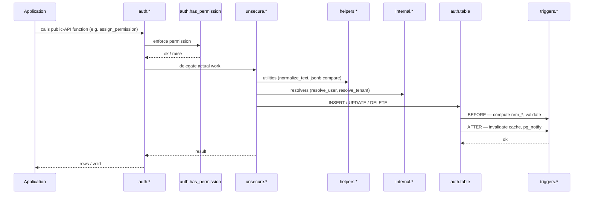

# PostgreSQL coding guidelines

The Bliss Framework's [general coding guidelines](../coding-guidelines/index.md) were written for application services. PostgreSQL — when used as more than a passive data store — earns its own dialect: schemas behave like access boundaries, functions are first-class units of behavior, migrations are forward-only and ordered, and the database has its own version of "I/O → Management → Providers" expressed through schema placement.

This section captures the adjustments specific to PostgreSQL-as-a-platform: long-lived libraries of stored functions, hierarchical permissions, cache invalidation via triggers, real-time pub/sub via `NOTIFY`/`LISTEN`, and the file/version conventions that keep a hundred migration scripts navigable.

Read the [general coding guidelines](../coding-guidelines/index.md) and [general naming conventions](../coding-guidelines/general-naming-conventions.md) first — everything here builds on them.

## What's different from a typical Bliss service

| Topic | C# / Elixir service | PostgreSQL |
|-------|---------------------|------------|
| Runtime | Long-lived OS process | Long-lived database — code lives in the database itself |
| Layering | I/O → Management → Providers maps to source folders | Same trio, expressed as **schemas** (`auth` / `unsecure` / `internal`+`helpers`+`error`+`triggers`) |
| File organization | Project structure + namespaces | Forward-only numbered scripts (`013_tables_auth.sql`, `022_functions_auth_permission.sql`) |
| Identifiers | PascalCase / camelCase | `snake_case` everywhere — keywords, identifiers, function names, columns |
| Errors | Exceptions with types | Numeric `errcode` raised through dedicated `error.raise_NNNNN(...)` functions |
| Validation | At the I/O layer | At the `auth.*` layer (permission check) and via `error.*` raises throughout |
| State | Mostly request-scoped | Persistent — every table is global state, caches and triggers must agree |
| Versioning | Git + binary releases | `__version` table per component, migrations are append-only forward scripts |
| "Side layer" | Models, helpers, constants | `helpers.*`, `const.*` (lookup tables), `error.*`, `triggers.*` |
| Pub/sub | Message bus | `pg_notify` from triggers, host subscribes with `LISTEN` |

## What stays the same

These Bliss principles apply unchanged:

1. **[Be replaceable](../consistency-is-bliss.md#be-replaceable)** — your tables, your function signatures, your error codes. The schema you write today will outlive several application rewrites; design it so a future maintainer can read it cold.
2. **[Ubiquitous Language](../learning-guidelines/basic-principles.md#domain-driven-development)** — `user`, `tenant`, `permission`, `group` mean the same thing in `auth.user_info`, the `users` REST endpoint, the `UsersProvider`, and the `Users.svelte` view. The general-conventions rule that a database table is singular (`user_info`) while a view is plural (`users`) is the same here.
3. **[DRY](../learning-guidelines/basic-principles.md#dont-repeat-yourself)** — error messages live in `error.raise_NNNNN(...)` functions, not as raw `RAISE` statements scattered through business logic. Lookup values live in `const.*` tables referenced by FK, not as repeated `CHECK (status IN ('a','b','c'))` constraints.
4. **[Use only what you need](../learning-guidelines/basic-principles.md#use-only-what-you-need)** — no premature abstraction. A SQL function that does one INSERT does not need a wrapping `manage_*` plus a `do_*` plus a trigger. Add the layer only when a second caller appears.
5. **[Restrain yourself](../key-elements.md#restrain-yourself)** — one verb registry, one parameter-prefix convention, one error-raising mechanism, one audit pattern. Pick once and apply everywhere in the database.
6. **Side layer purity** — `helpers.*`, `const.*`, and `error.*` carry no dependencies on the business schemas (`auth`, your app). They could be lifted into a separate database tomorrow.

## Schema-shaped layering

The three-layer Bliss model still applies, expressed as schemas:



- **`auth.*`, `public.*` business functions** = **I/O**. The public API surface. Every entry point starts with `perform auth.has_permission(...)` (or the silent variant) before touching data. Translates between caller and the trusted internals.
- **`unsecure.*`** = **Management**. Trusted internal layer. Performs the actual mutations and orchestration. Never exposed directly to application code or to roles that aren't system-trusted. The name is deliberately ugly so nobody accidentally grants it.
- **`internal.*`** = **Management's helpers**. Cross-cutting resolvers and validators (`resolve_user`, `resolve_tenant`, `resolve_cross_tenant_access`, `throw_no_permission`). One step below `unsecure.*` in trust, used by both `auth.*` and `unsecure.*`.
- **`helpers.*`** = **Side layer / Helpers**. Pure utilities — string normalization, jsonb comparison, ltree manipulation, random-string generation. Marked `immutable` or `stable`, never touch tables.
- **`const.*`** = **Side layer / Constants & Enums**. Lookup tables (`const.user_type`, `const.token_type`, `const.event_code`) referenced by FK instead of `CHECK` constraints. The PG equivalent of an enum that you can extend without an ALTER.
- **`error.*`** = **Side layer / Errors**. One `raise_NNNNN(...)` function per error code. Centralizes message wording and error codes; callers `perform error.raise_NNNNN(...)`.
- **`triggers.*`** = **Side layer / Triggers**. Trigger functions live here, not next to the table they fire on. Split by responsibility: calculated columns (`triggers.calculate_*`), cache invalidation (`triggers.cache_*`), notifications (`triggers.notify_*`).
- **`stage.*`** = **I/O for batch imports**. Staging tables for ETL — external group sync, CSV imports, anything that lands before being processed into the canonical tables.
- **`ext`** = **External extensions** (`ltree`, `uuid-ossp`, `unaccent`, `pg_trgm`). Pinned to one schema so search-path management is predictable.

!!! warning "Don't cross the streams"

    The Bliss rule that providers don't call other providers applies inside the database too. `unsecure.*` functions may call `helpers.*`, `internal.*`, and `error.*` freely — those are Side layer. They may NOT call `auth.*` functions, which would loop the permission check back on itself. Triggers may call `unsecure.*` (cache invalidation, notifications) but not `auth.*`. If you find yourself wanting `auth.foo` to call `auth.bar`, extract the shared work into `unsecure.bar` and have both call it.

## The public/internal/unsecure rule in one paragraph

`public` and `auth` **always** check permissions (the only exceptions are utilities like `public.get_app_version`). `internal` is for business logic that is already permission-checked by a calling `auth.*` function, or that runs in a trusted server context. `unsecure` is **only** for security-system internals — cache invalidation, identity resolution, internal session management. Do not put business logic in `unsecure` just because the permission check is inconvenient. If you need an unchecked business function, the answer is "you don't" — wrap it in an `auth.*` function and add the right permission.

## Multi-tenant access pattern

The framework reserves **tenant 1 as the admin/super tenant**. In single-tenant apps this is invisible; in multi-tenant apps tenant 1 is the admin console with cross-tenant visibility. Search and read functions take a pair of arguments:

- `_tenant_id` — the **caller's** tenant, used for the permission check
- `_target_tenant_id` — which tenant's data to query (often optional / null = all)

If `_tenant_id = 1` and the caller has the `domain.read_all_*` permission, cross-tenant access is allowed. Otherwise only the caller's own tenant data is returned. Each domain has paired permissions:

| Permission | Scope |
|------------|-------|
| `users.read_users` | Caller's own tenant |
| `users.read_all_users` | All tenants (admin-tenant only) |

The decision logic is centralized in `internal.resolve_cross_tenant_access(...)`, used by every multi-tenant search function. Do not re-implement the rule in each function; call the resolver.

Default `_tenant_id integer default 1` everywhere — the value is harmless for single-tenant apps and meaningful for multi-tenant ones.

## Version management and migrations

Migrations are **forward-only**, ordered by 3-digit numeric prefix (`013_tables_auth.sql`, `022_functions_auth_permission.sql`), and tracked in `public.__version`. Each script begins with `start_version_update(...)` and ends with `stop_version_update(...)`; both take a `_component` argument so the same database can track several independent migration lines (`main`, `common_helpers`, `postgresql_permissionmodel`, your application).

```sql
select * from public.start_version_update('1.6', 'Add ltree helpers',
    _component := 'common_helpers',
    _description := 'helpers.path_to_ltree, helpers.ltree_parent');

-- ... migration body ...

select * from public.stop_version_update('1.6', _component := 'common_helpers');
```

There is no down-migration. If you need to undo something, write the next forward script.

See [naming conventions](./naming-conventions.md) for the file-numbering rules.

## Audit, journal, and notifications

Every mutation function ends by writing a row to `public.journal` (via `create_journal_message_for_entity(...)`) with:

- `event_id` — numeric code from `const.event_code`
- `keys` — JSONB of entity references (`{"user": 42, "tenant": 1}`)
- `data_payload` — JSONB of template values for the human-readable message
- `correlation_id` — passed through from the caller, indexed for tracing

Real-time consumers subscribe via `LISTEN` to channels emitted by `triggers.notify_*` functions. The trigger doesn't know who's listening; resolution of "which users care about this change" happens in dedicated views (`auth.notify_group_users`, `auth.notify_perm_set_users`, …) consulted by the host application.

Correlation IDs flow end-to-end: the application generates one per request, passes it as `_correlation_id text` into every `auth.*` call, and it lands in both `journal` and `auth.user_event`.

## What this section covers

- [Naming conventions](./naming-conventions.md) — schemas, tables, columns, functions, parameters, return columns, the underscore-prefix variable rules (`_` / `__` / `___`), triggers, indexes, error functions, file numbering, the public-API-types rule, the SQL-keyword-case rule, anti-patterns, worked examples.

## See also

- [General naming conventions](../coding-guidelines/general-naming-conventions.md) — the shared verb registry (`Create`, `Update`, `Delete`, `Get`, `Search`, `Process`, `Map`, `Check`, …) and the singular-table / plural-view rule.
- [General coding structure](../coding-guidelines/layers-of-application.md) — the three-layer model and Side layer rules.
- [JavaScript / web-component guidelines](../coding-guidelines-javascript/index.md) — the sister page showing how the same Bliss principles re-shape themselves in a different runtime.
