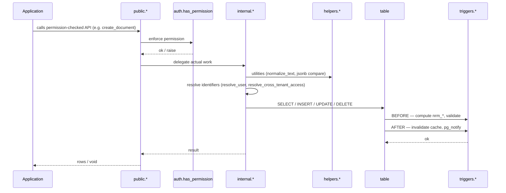

# Schemas & structure

The three-layer Bliss model still applies in PostgreSQL, expressed as schemas. It's a small, fixed set — don't invent new schemas casually; each one is an access boundary the application has to grant on.

- **I/O** — `public.*` / `auth.*` (the public API surface; every entry point permission-checks) and `stage.*` (batch / ETL landing tables).
- **Management** — `internal.*` (the trusted business-logic implementation layer), with `unsecure.*` reserved for highly sensitive auth/authz internals.
- **Side** — `helpers.*`, `const.*`, `error.*`, `triggers.*`, plus `ext` for pinned extensions.

## Schemas

| Schema | Role | What lives here |
|--------|------|-----------------|
| `public` | Application-level "public" | Cross-cutting infrastructure (`__version`, `journal`, version-tracking functions, `format_journal_message`, app-specific public functions). Always permission-checks where appropriate. |
| `auth` | Authorization domain + public API | All `auth.user_info`, `auth.tenant`, `auth.permission`, `auth.permission_assignment` tables AND the `auth.*` functions that wrap them with permission checks. The application's primary entry point. |
| `unsecure` | Highly sensitive auth/authz internals | Reserved **only** for the security system itself — permission-model mutations (`assign_permission`), permission-cache invalidation, token / session / credential handling, permission-change notifications. No permission checks; deliberately ugly name so nobody grants it. Ordinary business logic does **not** go here — it goes in `internal`. |
| `internal` | Trusted business logic (no permission check) | The general implementation layer for application domains — reads **and** mutates business tables. Holds the shared body that permission-checked `public.*` / `auth.*` wrappers delegate to (e.g. both `get_documents_by_user_id` and `get_documents_by_username` call `internal.get_documents_by_user_id`), functions run from trusted jobs (`recalculate_download_counts`), and resolvers / validators (`resolve_user`, `resolve_cross_tenant_access`, `throw_no_permission`). Skips permission checks because the caller already ran them, or because it runs in a trusted server context. |
| `helpers` | Generic pure utilities | **Domain-agnostic** functions that **never touch tables** — string normalization, jsonb operations, ltree manipulation, parsing (e.g. extract an order number out of a text). Marked `immutable` / `stable` / `parallel safe`. |
| `const` | Lookup tables | `const.token_type`, `const.user_type`, `const.event_code`, `const.sys_param`. FK target instead of `CHECK` enums. |
| `error` | Error functions | One `error.raise_NNNNN(...)` per error code. Centralized message wording. |
| `triggers` | Trigger functions | Trigger function bodies, separated from the tables they fire on for clarity. |
| `stage` | Batch / ETL staging | Tables that hold imported rows before they are processed into the canonical schemas. |
| `ext` | External extensions | `ltree`, `uuid-ossp`, `unaccent`, `pg_trgm`. Pinned here so `search_path` is predictable. |

## Request flow



This is the **general** path: a permission-checked `public.*` (or app-specific) wrapper enforces the check via `auth.has_permission`, then does the work — delegating to an `internal.*` worker only when it's worth it (the logic is shared by more than one wrapper, or complex enough to extract). A simple one-table operation can run right in the wrapper after the check; don't add an `internal.*` layer just for the sake of it. For **auth/authz-sensitive** work — assigning permissions, issuing tokens, invalidating the permission cache — the entry point is `auth.*` and the worker is `unsecure.*`; the shape is otherwise identical (see the worked example on the [Anti-patterns & example](anti-patterns-and-example.md) page). A background job skips the wrapper entirely and calls `internal.*` directly — it runs in a trusted context (usually as a service `_user_id`), so no permission check applies.

## Calling rules

- **`public` / `auth` always permission-check.** Every user-facing entry point runs `perform auth.has_permission(...)` before touching data (the only exceptions are utilities like `public.get_app_version`).
- **`internal.*` never permission-checks, and application code never calls it directly.** It runs only *after* a `public.*` / `auth.*` wrapper has already checked, or in a **trusted server context** — a background job running as a service user (still passes a `_user_id`, e.g. `internal.recalculate_download_counts`), or a pure maintenance task with no actor at all (`internal.vacuum_tables`). It skips the check because the context is trusted, not because the caller is unauthenticated. It reads and mutates freely.
- **`unsecure.*` is reserved for auth/authz internals only** — permission-model mutations, permission-cache invalidation, token / session handling. Ordinary business mutations belong in `internal.*`, not here.

!!! warning "Don't cross the streams"

    The Bliss rule that providers don't call other providers applies inside the database too. `internal.*` and `unsecure.*` may call `helpers.*`, other `internal.*`, and `error.*` freely — none carry permission checks — but must **not** call `auth.*` (that would loop the permission check back on itself). Triggers may call `unsecure.*` (cache invalidation, notifications) but not `auth.*`. If you want `auth.foo` to call `auth.bar`, extract the shared work into `internal.bar` (or `unsecure.bar` if it's auth/authz-sensitive) and have both call it.

### Worked pattern — two wrappers, one internal worker

Two permission-checked public wrappers over a single internal worker:

```sql
-- both public entry points check permission, then delegate to the same internal worker
create or replace function public.get_documents_by_user_id(_user_id bigint, _correlation_id text, _target_user_id bigint, _tenant_id integer default 1)
returns TABLE(__document_id bigint, __title text) language plpgsql as $$
begin
    perform auth.has_permission(_user_id, _correlation_id, 'documents.read_documents', _tenant_id);
    return query select * from internal.get_documents_by_user_id(_target_user_id, _tenant_id);
end; $$;

create or replace function public.get_documents_by_username(_user_id bigint, _correlation_id text, _username text, _tenant_id integer default 1)
returns TABLE(__document_id bigint, __title text) language plpgsql as $$
begin
    perform auth.has_permission(_user_id, _correlation_id, 'documents.read_documents', _tenant_id);
    return query select * from internal.get_documents_by_user_id(internal.resolve_user(_username), _tenant_id);
end; $$;
```

`internal.recalculate_download_counts()` follows the other path — called only by a scheduled job in a trusted context (as a service user), so no permission check, mutates freely.

## `helpers` vs `internal`

The line is **generic vs business-aware**:

- If a function is self-contained and domain-agnostic — parse an order number out of a string, hash a jsonb, normalize text, manipulate an ltree — it belongs in `helpers`. It takes its inputs as arguments, touches no tables, and could be lifted into any other database unchanged (`immutable` / `stable`).
- The moment it needs to **read or write business tables** or encodes **domain rules** (resolve a user, decide cross-tenant access, recalculate download counts from a job, or the shared body behind two permission-checked wrappers), it belongs in `internal` instead — no longer generic. Who may invoke it is covered by the [Calling rules](#calling-rules) above.

## Application-specific schemas

If you need an application-specific schema (`billing`, `inventory`, …), follow the same split: `billing` for its tables and permission-checked public functions, put its trusted implementation logic in the global `internal` (reached via those wrappers or by jobs), and reuse the global `helpers` / `const` / `error` / `triggers`. You rarely need a new `unsecure`-style schema — that tier is only for auth/authz internals.
