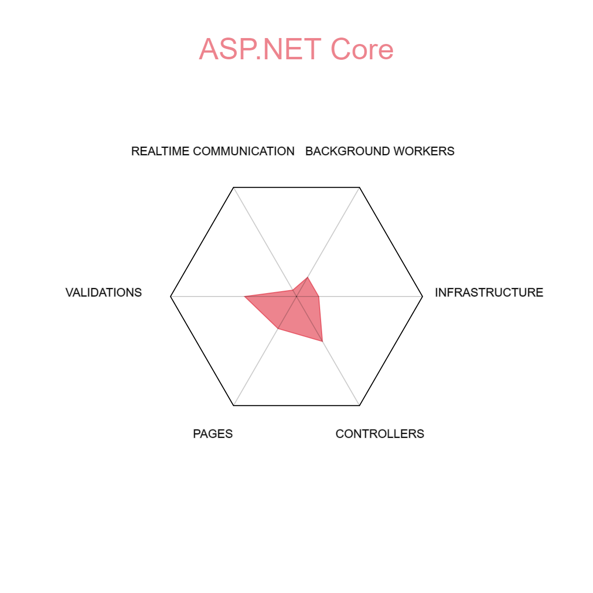

# Learning spiral

If we image that all knowledge about certain technology, language a library is a plane, where different aspects of it goes to different directions, as you can see on the example below, when you start with it, you are always in the middle.

{ align=left }

You can always go only one direction, or perhaps two, but not more, and here lays the biggest problem. If you focus on one direction too much, you'll miss the rest of it.

That's why we learn in a spiral. We always start with the simplest thing possible, which is installation, and then we start collecting knowledge by small dips, here and there.

You can imagine knowledge to be as a bucket of ice cream you just pulled out of your freezer. If you try to scrape too much of it with your spoon, or you go too deep, it will be too hard, almost impossible to do. If you go slow and shallow, you get to enjoy what you can, you start getting to know what spots are weaker and harder, and those you keep for later when they melt down a bit.

## Repetitio est mater studiorum

!!! note "Bruce Lee said" 
    I fear not the man who has practiced 10,000 kicks once, but I fear the man who has practiced one kick 10,000 times.

There is no way around it, until you repeat something 10s, 100s and even 1000s of times, it won't be truly stored in your brain.

We know we live in the age of ChatGPT and Copilot, and that it's so easy to generate some code these days, but you are just cheating yourself, you cannot learn something by watching someone else do it for you.

But there is a silver lining in all of this. The more you repeat one technology, the easier is to learn another. Your brain will start to see patterns and similarities in different technologies, and with each technology it will be simplier and easier.

So buckle up, start with the basics, repeat them while always adding some small portion of something new.

Example:

    - create a Svelte application
    - delete it
    - create another Svelte application
    - delete it again
    - create yet another Svelte application
    - run it
    - delete it
    - create another Svelte application
      - at this point you start to wonder how to create them faster and start looking at the command line arguments
    - run it
    - see the outcome of build in your browser
    - change something in the generated page
    - check the outcome again
    - delete the app
    - start all over

This is the fastest way how get familiar with some technology, in spiral manner, and also create muscle memory that gives you confidence.

